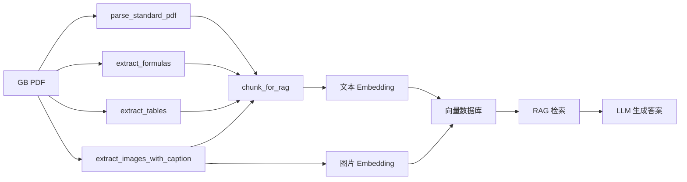

# GB 标准文档解析 MCP Server 完整实施方案 (多模型支持版)

## 1. 方案概述

### 1.1 项目背景
针对**国家标准文档（如 GB151）**的复杂场景设计，解决以下核心痛点：
- **图片型/扫描版 PDF**：普通 OCR 识别率低
- **公式乱码**：热计算、力学公式无法正确提取
- **表格错行**：参数表、规格表结构丢失
- **水印干扰**：影响 OCR 准确性
- **RAG 分片难**：公式/表格/图片被切断，语义不完整
- **图表无语义**：示意图、流程图无法加入检索

### 1.2 技术架构
```
┌─────────────────────────────────────────────────────────────┐
│                    MCP Client (Cursor/Claude)                │
└─────────────────────────────────────────────────────────────┘
                              │
                              ▼
┌─────────────────────────────────────────────────────────────┐
│                    你的 MCP Router                           │
└─────────────────────────────────────────────────────────────┘
                              │
                              ▼
┌─────────────────────────────────────────────────────────────┐
│              自定义 MinerU MCP Server (Docker)               │
│  ┌─────────────┐  ┌─────────────┐  ┌─────────────────────┐  │
│  │ server.py   │  │ parser.py   │  │ vlm_client.py       │  │
│  │ MCP 工具定义 │  │ 解析逻辑    │  │ 统一 VLM 客户端      │  │
│  └─────────────┘  └─────────────┘  └─────────────────────┘  │
│                              │                                │
│                              ▼                                │
│  ┌─────────────────────────────────────────────────────────┐ │
│  │         MinerU (magic-pdf) + VLM (多模型支持)            │ │
│  │   Qwen-VL / GPT-4o / GLM-4V (OpenAI 兼容协议)            │ │
│  └─────────────────────────────────────────────────────────┘ │
└─────────────────────────────────────────────────────────────┘
                              │
                              ▼
┌─────────────────────────────────────────────────────────────┐
│                    RAG Pipeline                              │
│   文本 Embedding + 图片 Embedding → 向量数据库 → 检索生成    │
└─────────────────────────────────────────────────────────────┘
```

### 1.3 核心优势
| 特性 | 说明 |
| :--- | :--- |
| **多模型支持** | Qwen-VL / GPT-4o / GLM-4V 自由切换，无需改代码 |
| **统一接口** | 所有模型兼容 OpenAI 协议，只需 `openai` 一个库 |
| **配置驱动** | 修改 `.env` 中的 `VLM_MODEL_PROVIDER` 即可切换模型 |
| **Docker 部署** | 一键启动，环境隔离，易于扩展 |
| **语义化输出** | 公式→LaTeX，表格→Markdown，图片→描述文本 |
| **RAG 就绪** | 直接输出带 metadata 的分片，可入库检索 |

---

## 2. 项目结构

```text
my-mineru-mcp/
├── docker-compose.yml          # Docker 编排配置
├── Dockerfile                  # 镜像构建文件
├── .env                        # 环境变量 (API Key 等)
├── requirements.txt            # Python 依赖
├── server.py                   # MCP Server 入口 (HTTP/SSE 模式)
├── parser.py                   # 文档解析核心逻辑
├── vlm_client.py               # 统一 VLM 客户端 (多模型支持)
├── config/
│   └── magic-pdf.json          # MinerU 配置文件
└── data/
    ├── input/                  # 待解析 PDF 目录
    └── output/                 # 解析输出目录 (图片/中间文件)
```

---

## 3. 完整工具清单

### 3.1 核心工具集 (P0 - 必须实现)

| 工具名称 | 功能描述 | 输入参数 | 输出结果 |
| :--- | :--- | :--- | :--- |
| **`parse_standard_pdf`** | 通用解析国标 PDF，返回 Markdown 全文 | `file_path` | Markdown 文本 |
| **`export_renderable_markdown`** | 导出可渲染的 Markdown 文件 | `file_path`, `output_path` | 文件路径/内容 |
| **`extract_formulas`** | 专门提取公式并转 LaTeX | `file_path`, `pages` | `[{page, latex, bbox}]` |
| **`extract_tables`** | 专门提取表格并转 Markdown | `file_path`, `pages` | `[{page, markdown, bbox}]` |
| **`extract_images_with_caption`** | 提取图片并生成语义描述 | `file_path`, `pages` | `[{page, path, caption, bbox}]` |
| **`chunk_for_rag`** | 输出 RAG 就绪的分片结果 | `file_path`, `chunk_size`, `include_images` | `[{content, metadata, image_refs}]` |

### 3.2 辅助与调试工具集 (P1 - 强烈建议)

| 工具名称 | 功能描述 | 输入参数 | 输出结果 |
| :--- | :--- | :--- | :--- |
| **`check_watermark`** | 检测水印位置/强度 | `file_path` | `{has_watermark, locations}` |
| **`get_layout_info`** | 获取版面分析详情 (JSON) | `file_path`, `page` | `{blocks: [{type, bbox}]}` |
| **`get_document_info`** | 获取元信息 (页数/尺寸) | `file_path` | `{pages, width, height}` |
| **`health_check`** | 服务健康检查 | 无 | `"OK"` |

---

## 4. 核心代码实现

### 4.1 `.env` (环境变量配置)

```ini
# ================= VLM 模型配置 =================

# 模型提供商 (qwen / gpt-4o / glm-4v)
# 修改此值即可切换模型，无需改代码
VLM_MODEL_PROVIDER=qwen

# Qwen-VL 配置 (DashScope)
QWEN_API_KEY=sk-your-qwen-api-key
QWEN_BASE_URL=https://dashscope.aliyuncs.com/compatible-mode/v1
QWEN_MODEL_NAME=qwen-vl-max-latest

# GPT-4o 配置 (OpenAI)
OPENAI_API_KEY=sk-your-openai-api-key
OPENAI_BASE_URL=https://api.openai.com/v1
OPENAI_MODEL_NAME=gpt-4o

# GLM-4V 配置 (智谱 AI)
ZHIPU_API_KEY=your-zhipu-api-key
ZHIPU_BASE_URL=https://open.bigmodel.cn/api/paas/v4
ZHIPU_MODEL_NAME=glm-4v

# ================= MinerU 配置 =================
MINERU_OUTPUT_DIR=/app/data/output
LOG_LEVEL=INFO
MODELSCOPE_CACHE=/app/models
```

### 4.2 `vlm_client.py` (统一 VLM 客户端)

```python
# vlm_client.py
import os
from openai import OpenAI
from base64 import b64encode

class UnifiedVLMClient:
    """
    统一 VLM 客户端，支持所有 OpenAI 兼容的模型
    
    支持的模型提供商：
    - qwen: 阿里云 Qwen-VL (DashScope)
    - gpt-4o: OpenAI GPT-4o
    - glm-4v: 智谱 AI GLM-4V
    
    切换模型只需修改 .env 中的 VLM_MODEL_PROVIDER
    """
    
    def __init__(
        self,
        api_key: str = None,
        base_url: str = None,
        model: str = None
    ):
        # 从环境变量读取配置
        self.provider = os.getenv("VLM_MODEL_PROVIDER", "qwen")
        self.api_key = api_key or self._get_api_key()
        self.base_url = base_url or self._get_base_url()
        self.model = model or self._get_model_name()
        
        # 创建 OpenAI 客户端 (所有兼容模型都用这个)
        self.client = OpenAI(
            api_key=self.api_key,
            base_url=self.base_url
        )
    
    def _get_api_key(self) -> str:
        """根据 provider 获取对应的 API Key"""
        key_map = {
            "qwen": os.getenv("QWEN_API_KEY"),
            "gpt-4o": os.getenv("OPENAI_API_KEY"),
            "glm-4v": os.getenv("ZHIPU_API_KEY"),
        }
        key = key_map.get(self.provider)
        if not key:
            raise ValueError(f"No API key found for provider: {self.provider}. Please set {self.provider.upper()}_API_KEY in .env")
        return key
    
    def _get_base_url(self) -> str:
        """根据 provider 获取对应的 Base URL"""
        url_map = {
            "qwen": os.getenv("QWEN_BASE_URL", "https://dashscope.aliyuncs.com/compatible-mode/v1"),
            "gpt-4o": os.getenv("OPENAI_BASE_URL", "https://api.openai.com/v1"),
            "glm-4v": os.getenv("ZHIPU_BASE_URL", "https://open.bigmodel.cn/api/paas/v4"),
        }
        return url_map.get(self.provider)
    
    def _get_model_name(self) -> str:
        """根据 provider 获取对应的模型名称"""
        model_map = {
            "qwen": os.getenv("QWEN_MODEL_NAME", "qwen-vl-max-latest"),
            "gpt-4o": os.getenv("OPENAI_MODEL_NAME", "gpt-4o"),
            "glm-4v": os.getenv("ZHIPU_MODEL_NAME", "glm-4v"),
        }
        return model_map.get(self.provider)
    
    def encode_image(self, image_path: str) -> str:
        """将图片编码为 base64"""
        with open(image_path, "rb") as image_file:
            return b64encode(image_file.read()).decode('utf-8')
    
    def recognize_complex_content(self, image_path: str, task_type: str = "general") -> str:
        """
        识别图片内容
        
        Args:
            image_path: 图片路径
            task_type: 'formula', 'table', 'figure_caption', 'general'
        
        Returns:
            识别结果字符串
        """
        base64_image = self.encode_image(image_path)
        prompt = self._get_prompt(task_type)
        
        response = self.client.chat.completions.create(
            model=self.model,
            messages=[{
                "role": "user",
                "content": [
                    {"type": "text", "text": prompt},
                    {"type": "image_url", "image_url": {"url": f"image/jpeg;base64,{base64_image}"}}
                ]
            }],
            max_tokens=1024,
            temperature=0.1  # 低温度，确保输出稳定
        )
        return response.choices[0].message.content
    
    def _get_prompt(self, task_type: str) -> str:
        """获取任务对应的 Prompt"""
        prompts = {
            "formula": "请识别图中的数学公式，输出标准的 LaTeX 格式。忽略背景水印。只输出公式，不要额外说明。",
            "table": "请识别图中的表格，输出 Markdown 格式。保持行列结构完整。忽略水印。",
            "figure_caption": "请用一句话描述这张图的内容，包括图中展示的设备、流程或结构。输出格式：'图 X-X [描述]'",
            "general": "请识别图中的文字内容，保持原有段落结构。忽略页眉页脚和水印。"
        }
        return prompts.get(task_type, prompts["general"])
    
    def get_model_name(self) -> str:
        """返回当前使用的模型名称"""
        return self.model
```

### 4.3 `parser.py` (解析逻辑核心)

```python
# parser.py
import os
import json
import fitz  # pymupdf
from magic_pdf.data.data_reader_writer import FileBasedDataWriter
from magic_pdf.data.read_api import read_local_pdf
from magic_pdf.pipe.OCRPipe import OCRPipe
from vlm_client import UnifiedVLMClient

class GBDocumentParser:
    """GB 标准文档解析器"""
    
    def __init__(self):
        self.output_dir = os.getenv("MINERU_OUTPUT_DIR", "/app/data/output")
        os.makedirs(self.output_dir, exist_ok=True)
        # 使用统一 VLM 客户端，自动根据环境变量选择模型
        self.vlm = UnifiedVLMClient()
    
    def _init_pipe(self, pdf_path):
        """初始化 MinerU 管道"""
        image_writer = FileBasedDataWriter(self.output_dir)
        pdf_docs = read_local_pdf(pdf_path)
        pipe = OCRPipe(pdf_docs, image_writer, None)
        pipe.pipe_classify()
        pipe.pipe_analyze()
        pipe.pipe_parse()
        return pipe
    
    def parse_full(self, pdf_path):
        """通用全文解析"""
        try:
            pipe = self._init_pipe(pdf_path)
            return {"success": True, "markdown": pipe.get_markdown()}
        except Exception as e:
            return {"success": False, "error": str(e)}
    
    def export_renderable_markdown(self, pdf_path, output_path=None):
        """导出可渲染的 Markdown"""
        try:
            pipe = self._init_pipe(pdf_path)
            md = pipe.get_markdown()
            
            # 格式校验与修复
            md = self._fix_markdown_format(md)
            
            if output_path:
                with open(output_path, 'w', encoding='utf-8') as f:
                    f.write(md)
                return {"success": True, "path": output_path}
            else:
                return {"success": True, "markdown": md}
        except Exception as e:
            return {"success": False, "error": str(e)}
    
    def _fix_markdown_format(self, md):
        """修复 Markdown 格式 (公式包裹、表格对齐等)"""
        # TODO: 实现公式 $ 包裹检查、表格 | 对齐检查
        return md
    
    def extract_formulas(self, pdf_path, pages=None):
        """
        专门提取公式：
        1. 获取 MinerU 识别到的公式块坐标
        2. 裁剪图片
        3. 调用 VLM 转 LaTeX
        """
        try:
            pipe = self._init_pipe(pdf_path)
            # 注意：需根据 MinerU 实际 API 获取公式块
            # 以下为伪代码框架
            results = []
            # for block in pipe.get_blocks(type='formula'):
            #     if pages and block.page not in pages: continue
            #     img_path = self._crop_block(pdf_path, block.bbox)
            #     latex = self.vlm.recognize_complex_content(img_path, task_type='formula')
            #     results.append({"page": block.page, "latex": latex, "bbox": block.bbox})
            return results
        except Exception as e:
            return [{"error": str(e)}]
    
    def extract_tables(self, pdf_path, pages=None):
        """
        专门提取表格：
        4. 获取表格块坐标
        5. 调用 VLM 转 Markdown Table
        """
        try:
            pipe = self._init_pipe(pdf_path)
            results = []
            # for block in pipe.get_blocks(type='table'):
            #     if pages and block.page not in pages: continue
            #     img_path = self._crop_block(pdf_path, block.bbox)
            #     md_table = self.vlm.recognize_complex_content(img_path, task_type='table')
            #     results.append({"page": block.page, "markdown": md_table, "bbox": block.bbox})
            return results
        except Exception as e:
            return [{"error": str(e)}]
    
    def extract_images_with_caption(self, pdf_path, pages=None):
        """
        提取图片并调用 VLM 生成描述
        """
        try:
            pipe = self._init_pipe(pdf_path)
            results = []
            # for block in pipe.get_blocks(type='image'):
            #     if pages and block.page not in pages: continue
            #     img_path = self._crop_block(pdf_path, block.bbox)
            #     caption = self.vlm.recognize_complex_content(img_path, task_type='figure_caption')
            #     results.append({
            #         "page": block.page,
            #         "image_path": img_path,
            #         "caption": caption,
            #         "bbox": block.bbox
            #     })
            return results
        except Exception as e:
            return [{"error": str(e)}]
    
    def chunk_for_rag(self, pdf_path, chunk_size=500, include_images=True):
        """
        输出 RAG 就绪的分片，包含图片引用
        """
        try:
            pipe = self._init_pipe(pdf_path)
            # 1. 获取所有块 (文本/公式/表格/图片)
            # 2. 按顺序合并，达到 chunk_size 切分
            # 3. 公式/表格/图片块不可分割
            # 4. 输出带 metadata 的 JSON
            
            chunks = []
            # 伪代码实现
            chunks.append({
                "chunk_id": "gb151_page5_chunk1",
                "content": "## 5.1 结构设计\n\n管壳式换热器主要由...\n\n$$Q = U \\cdot A \\cdot \\Delta T_m$$",
                "metadata": {
                    "source": os.path.basename(pdf_path),
                    "page": 5,
                    "section": "5.1 结构设计",
                    "types": ["text", "formula"]
                },
                "image_refs": [
                    {"path": "images/fig_5_1.png", "caption": "管壳式换热器结构示意图"}
                ] if include_images else []
            })
            return chunks
        except Exception as e:
            return [{"error": str(e)}]
    
    def _crop_block(self, pdf_path, bbox):
        """裁剪指定区域为图片"""
        # 使用 pymupdf 或 MinerU 内置方法
        img_path = os.path.join(self.output_dir, f"crop_{len(bbox)}.png")
        # TODO: 实现裁剪逻辑
        return img_path
    
    def detect_watermark(self, pdf_path):
        """水印检测"""
        try:
            # 简化版：调用 VLM 询问
            # img = pdf_to_image(pdf_path, page=1)
            # res = self.vlm.client.chat(..., messages=[{"role": "user", "content": ["Detect watermark?", img]}])
            return {"has_watermark": False, "locations": []}
        except Exception as e:
            return {"error": str(e)}
    
    def get_layout_info(self, pdf_path, page):
        """返回 MinerU 识别到的版面块信息 (调试用)"""
        try:
            pipe = self._init_pipe(pdf_path)
            # return pipe.get_layout_info(page)
            return {"blocks": [], "page": page}
        except Exception as e:
            return {"error": str(e)}
    
    def get_document_info(self, pdf_path):
        """返回页数等元信息"""
        try:
            doc = fitz.open(pdf_path)
            info = {
                "pages": len(doc),
                "width": doc[0].rect.width,
                "height": doc[0].rect.height,
                "is_scanned": self._check_is_scanned(doc)
            }
            doc.close()
            return info
        except Exception as e:
            return {"error": str(e)}
    
    def _check_is_scanned(self, doc):
        """检查是否为扫描版 (无文本层)"""
        # 检查第一页是否有文本
        page = doc[0]
        text = page.get_text()
        return len(text.strip()) < 50
```

### 4.4 `server.py` (MCP Server 入口)

```python
# server.py
import os
import asyncio
import json
from mcp.server.fastmcp import FastMCP
from parser import GBDocumentParser

# 初始化 MCP Server (HTTP/SSE 模式，适配 Docker)
mcp = FastMCP("GB-Standard-Parser", host="0.0.0.0", port=8000)
parser = GBDocumentParser()

# ================= 核心工具 (P0) =================

@mcp.tool()
async def parse_standard_pdf(file_path: str) -> str:
    """
    【核心】通用解析国标 PDF，返回 Markdown 全文。
    内部已集成 VLM 优化公式和表格。
    
    Args:
        file_path: PDF 文件路径 (相对于 /app/data/input 目录)
    """
    full_path = os.path.join("/app/data/input", file_path.lstrip("/"))
    if not os.path.exists(full_path):
        return f"Error: File not found: {full_path}"
    
    loop = asyncio.get_event_loop()
    result = await loop.run_in_executor(None, parser.parse_full, full_path)
    return result.get("markdown", result.get("error", "Unknown error"))

@mcp.tool()
async def export_renderable_markdown(file_path: str, output_path: str = None) -> str:
    """
    【核心】导出可渲染的 Markdown 文件。
    确保公式用 $ 包裹、表格格式正确、图片路径有效。
    
    Args:
        file_path: PDF 文件路径
        output_path: 输出文件路径 (可选，默认返回内容)
    """
    full_path = os.path.join("/app/data/input", file_path.lstrip("/"))
    if not os.path.exists(full_path):
        return json.dumps({"error": "File not found"})
    
    loop = asyncio.get_event_loop()
    result = await loop.run_in_executor(None, parser.export_renderable_markdown, full_path, output_path)
    return json.dumps(result, ensure_ascii=False, indent=2)

@mcp.tool()
async def extract_formulas(file_path: str, pages: list = None) -> str:
    """
    【核心】专门提取公式并转为 LaTeX。
    解决 GB151 等文档公式乱码问题。
    
    Args:
        file_path: PDF 文件路径
        pages: 指定页码列表 (可选，默认全部)
    """
    full_path = os.path.join("/app/data/input", file_path.lstrip("/"))
    if not os.path.exists(full_path):
        return json.dumps({"error": "File not found"})
    
    loop = asyncio.get_event_loop()
    formulas = await loop.run_in_executor(None, parser.extract_formulas, full_path, pages)
    return json.dumps(formulas, ensure_ascii=False, indent=2)

@mcp.tool()
async def extract_tables(file_path: str, pages: list = None) -> str:
    """
    【核心】专门提取表格并转为 Markdown。
    解决表格跨页、合并单元格错乱问题。
    
    Args:
        file_path: PDF 文件路径
        pages: 指定页码列表 (可选，默认全部)
    """
    full_path = os.path.join("/app/data/input", file_path.lstrip("/"))
    if not os.path.exists(full_path):
        return json.dumps({"error": "File not found"})
    
    loop = asyncio.get_event_loop()
    tables = await loop.run_in_executor(None, parser.extract_tables, full_path, pages)
    return json.dumps(tables, ensure_ascii=False, indent=2)

@mcp.tool()
async def extract_images_with_caption(file_path: str, pages: list = None) -> str:
    """
    【核心】提取图片/图表并调用 VLM 生成语义描述。
    输出包含：图片路径 + 文字描述 + 页码 + 坐标，用于 RAG 多模态检索。
    
    Args:
        file_path: PDF 文件路径
        pages: 指定页码列表 (可选，默认全部)
    """
    full_path = os.path.join("/app/data/input", file_path.lstrip("/"))
    if not os.path.exists(full_path):
        return json.dumps({"error": "File not found"})
    
    loop = asyncio.get_event_loop()
    images = await loop.run_in_executor(None, parser.extract_images_with_caption, full_path, pages)
    return json.dumps(images, ensure_ascii=False, indent=2)

@mcp.tool()
async def chunk_for_rag(file_path: str, chunk_size: int = 500, include_images: bool = True) -> str:
    """
    【核心】输出适合 RAG 的分片结果。
    基于版面块分片，确保公式/表格/图片完整性。
    
    Args:
        file_path: PDF 文件路径
        chunk_size: 每片最大字符数
        include_images: 是否包含图片引用
    """
    full_path = os.path.join("/app/data/input", file_path.lstrip("/"))
    if not os.path.exists(full_path):
        return json.dumps({"error": "File not found"})
    
    loop = asyncio.get_event_loop()
    chunks = await loop.run_in_executor(None, parser.chunk_for_rag, full_path, chunk_size, include_images)
    return json.dumps(chunks, ensure_ascii=False, indent=2)

# ================= 辅助工具 (P1) =================

@mcp.tool()
async def check_watermark(file_path: str) -> str:
    """检测文档是否有水印及其位置。"""
    full_path = os.path.join("/app/data/input", file_path.lstrip("/"))
    info = parser.detect_watermark(full_path)
    return json.dumps(info, ensure_ascii=False, indent=2)

@mcp.tool()
async def get_layout_info(file_path: str, page: int = 1) -> str:
    """获取指定页的版面分析详情 (用于调试识别错误)。"""
    full_path = os.path.join("/app/data/input", file_path.lstrip("/"))
    info = parser.get_layout_info(full_path, page)
    return json.dumps(info, ensure_ascii=False, indent=2)

@mcp.tool()
async def get_document_info(file_path: str) -> str:
    """获取文档元信息 (页数、尺寸、是否扫描版)。"""
    full_path = os.path.join("/app/data/input", file_path.lstrip("/"))
    info = parser.get_document_info(full_path)
    return json.dumps(info, ensure_ascii=False, indent=2)

@mcp.resource("health")
async def health_check() -> str:
    """健康检查端点"""
    return "OK"

if __name__ == "__main__":
    # 启动 HTTP 服务器 (适配 Docker)
    mcp.run(transport="sse")
```

---

## 5. Docker 部署配置

### 5.1 `requirements.txt`

```txt
# 核心依赖
mcp>=0.1.0
mineru[full]>=1.0.0
openai>=1.0.0
pymupdf>=1.23.0

# 可选：如果需要 Claude (不兼容 OpenAI 协议)
# anthropic

# 可选：如果需要 Gemini (不兼容 OpenAI 协议)
# google-generativeai
```

### 5.2 `Dockerfile`

```dockerfile
FROM opendatalab/mineru:latest

# 设置工作目录
WORKDIR /app

# 配置 pip 使用阿里云镜像 (加速安装)
RUN pip config set global.index-url https://mirrors.aliyun.com/pypi/simple

# 安装 MCP 和 OpenAI 客户端
COPY requirements.txt .
RUN pip install -r requirements.txt

# 复制应用代码
COPY server.py .
COPY parser.py .
COPY vlm_client.py .
COPY config/ ./config/

# 创建数据目录
RUN mkdir -p /app/data/input /app/data/output /app/models

# 暴露 HTTP 端口 (MCP over SSE)
EXPOSE 8000

# 启动命令
CMD ["python", "server.py"]
```

### 5.3 `docker-compose.yml`

```yaml
version: '3.8'

services:
  mineru-mcp:
    build: .
    container_name: mineru-mcp-server
    ports:
      - "8000:8000"
    volumes:
      # 挂载 PDF 输入目录
      - ./data/input:/app/data/input:ro
      # 挂载输出目录
      # 挂载 MinerU 配置
      - ./config/magic-pdf.json:/root/.magic-pdf/config.json
      # 模型缓存 (避免重复下载)
      - ./models:/app/models
    environment:
      # 模型提供商 (qwen / gpt-4o / glm-4v)
      - VLM_MODEL_PROVIDER=${VLM_MODEL_PROVIDER:-qwen}
      
      # Qwen-VL 配置
      - QWEN_API_KEY=${QWEN_API_KEY}
      - QWEN_BASE_URL=${QWEN_BASE_URL:-https://dashscope.aliyuncs.com/compatible-mode/v1}
      - QWEN_MODEL_NAME=${QWEN_MODEL_NAME:-qwen-vl-max-latest}
      
      # GPT-4o 配置
      - OPENAI_API_KEY=${OPENAI_API_KEY}
      - OPENAI_BASE_URL=${OPENAI_BASE_URL:-https://api.openai.com/v1}
      - OPENAI_MODEL_NAME=${OPENAI_MODEL_NAME:-gpt-4o}
      
      # GLM-4V 配置
      - ZHIPU_API_KEY=${ZHIPU_API_KEY}
      - ZHIPU_BASE_URL=${ZHIPU_BASE_URL:-https://open.bigmodel.cn/api/paas/v4}
      - ZHIPU_MODEL_NAME=${ZHIPU_MODEL_NAME:-glm-4v}
      
      # MinerU 配置
      - MINERU_OUTPUT_DIR=/app/data/output
      - LOG_LEVEL=INFO
      - MODELSCOPE_CACHE=/app/models
    restart: unless-stopped
    healthcheck:
      test: ["CMD", "curl", "-f", "http://localhost:8000/health"]
      interval: 30s
      timeout: 10s
      retries: 3
```

### 5.4 `config/magic-pdf.json` (MinerU 配置)

```json
{
    "vip_model": false,
    "cpu_only": true,
    "models": {
        "vlm": {
            "type": "openai",
            "base_url": "https://dashscope.aliyuncs.com/compatible-mode/v1",
            "api_key": "${QWEN_API_KEY}",
            "model_name": "qwen-vl-max-latest"
        }
    }
}
```

---

## 6. 部署与使用指南

### 6.1 快速启动

```bash
# 1. 克隆/创建项目目录
mkdir -p my-mineru-mcp && cd my-mineru-mcp

# 2. 创建必要目录
mkdir -p data/input data/output config models

# 3. 创建 .env 文件 (以 Qwen-VL 为例)
cat > .env << EOF
VLM_MODEL_PROVIDER=qwen
QWEN_API_KEY=sk-your-qwen-api-key
QWEN_BASE_URL=https://dashscope.aliyuncs.com/compatible-mode/v1
QWEN_MODEL_NAME=qwen-vl-max-latest
MINERU_OUTPUT_DIR=/app/data/output
EOF

# 4. 构建并启动
docker-compose up -d --build

# 5. 查看日志
docker-compose logs -f

# 6. 健康检查
curl http://localhost:8000/health
```

### 6.2 切换模型

```bash
# 切换到 GPT-4o
cat > .env << EOF
VLM_MODEL_PROVIDER=gpt-4o
OPENAI_API_KEY=sk-your-openai-api-key
OPENAI_MODEL_NAME=gpt-4o
EOF
docker-compose restart

# 切换到 GLM-4V
cat > .env << EOF
VLM_MODEL_PROVIDER=glm-4v
ZHIPU_API_KEY=your-zhipu-api-key
ZHIPU_MODEL_NAME=glm-4v
EOF
docker-compose restart
```

### 6.3 测试解析

```bash
# 1. 放入测试 PDF
cp GB151-2020.pdf ./data/input/

# 2. 调用 MCP 工具 (通过你的 MCP Router)
# 示例：解析全文
parse_standard_pdf("GB151-2020.pdf")

# 示例：提取公式
extract_formulas("GB151-2020.pdf", [5, 6, 7])

# 示例：RAG 分片
chunk_for_rag("GB151-2020.pdf", 500, true)
```

### 6.4 MCP Router 配置

```json
{
  "mcpServers": {
    "gb-parser": {
      "url": "http://localhost:8000/sse",
      "transport": "sse",
      "timeout": 300
    }
  }
}
```

---

## 7. RAG 工作流



### 7.1 分片输出示例

```json
[
  {
    "chunk_id": "gb151_page5_chunk1",
    "content": "## 5.1 结构设计\n\n管壳式换热器主要由壳体、管束、折流板等组成...\n\n$$Q = U \\cdot A \\cdot \\Delta T_m$$\n\n",
    "metadata": {
      "source": "GB151-2020.pdf",
      "page": 5,
      "section": "5.1 结构设计",
      "types": ["text", "formula", "image"]
    },
    "image_refs": [
      {
        "path": "images/fig_5_1.png",
        "caption": "图 5-1 管壳式换热器结构示意图，显示壳体、管束、折流板等组件",
        "embedding_ready": true
      }
    ]
  }
]
```

---

## 8. 模型对比与选择建议

| 模型 | 优点 | 缺点 | 适用场景 | 价格参考 |
| :--- | :--- | :--- | :--- | :--- |
| **Qwen-VL-Max** | 中文效果好，公式识别强，国内访问快 | 英文稍弱 | 国标/中文文档首选 | ¥0.02/千 tokens |
| **GPT-4o** | 综合能力强，多语言支持好 | 价格贵，国内网络不稳定 | 英文文档/多语言场景 | $0.03/千 tokens |
| **GLM-4V** | 中文好，国内访问快，性价比高 | 生态相对小 | 备选方案 | ¥0.01/千 tokens |
| **Qwen2.5-VL-72B** | 开源可本地部署，数据隐私好 | 需要 GPU 资源 | 涉密文档/本地部署 | 免费 (需硬件) |

---

## 9. 常见问题排查

| 问题 | 可能原因 | 解决方案 |
| :--- | :--- | :--- |
| **安装依赖超时** | 网络问题 | 使用 `-i https://mirrors.aliyun.com/pypi/simple` |
| **公式仍为乱码** | 未触发 VLM | 检查 `vlm_client.py` 是否正确调用 API |
| **MCP 连接失败** | 端口/路径错误 | 检查 `docker-compose.yml` 端口映射和 Router 配置 |
| **PDF 路径找不到** | 挂载目录错误 | 检查 `volumes` 配置，确保文件在 `./data/input` |
| **API 限流** | 并发过高 | 在代码中加入信号量控制或 `time.sleep` |
| **内存不足** | 文档过大 | 在 `docker-compose.yml` 中限制 `mem_limit` |
| **模型切换无效** | 环境变量未生效 | 重启容器 `docker-compose restart` |

---

## 10. 安全与合规提示

1.  **版权风险**：国家标准（GB）通常受版权保护。请确保你的知识库平台仅在授权范围内使用。
2.  **数据隐私**：文档内容会传输至第三方 API。若文档涉密，需使用本地部署的 VLM 模型。
3.  **API 成本**：图片型 PDF 解析消耗 Token 较多，建议监控账单，设置用量预警。
4.  **API Key 安全**：不要将 `.env` 文件提交到 Git，使用 `.gitignore` 忽略。

---

## 11. 后续扩展建议

| 扩展方向 | 说明 |
| :--- | :--- |
| **批量解析** | 增加 `batch_parse` 工具，处理整个目录的 PDF |
| **版本对比** | 增加 `compare_versions` 工具，对比两个版本文档差异 |
| **摘要生成** | 增加 `generate_summary` 工具，调用 LLM 生成文档摘要 |
| **多模态检索** | 接入 CLIP/SigLIP，实现图片内容的向量检索 |
| **缓存优化** | 对已解析的 PDF 进行哈希缓存，避免重复解析 |
| **模型降级** | 主模型失败时自动切换到备选模型 |

---

## 12. 附录：VLM 兼容性说明

### 12.1 支持的模型 (OpenAI 兼容协议)

| 模型 | 提供商 | base_url | 依赖库 |
| :--- | :--- | :--- | :--- |
| Qwen-VL-Max | 阿里云 DashScope | `https://dashscope.aliyuncs.com/compatible-mode/v1` | `openai` |
| GPT-4o | OpenAI | `https://api.openai.com/v1` | `openai` |
| GLM-4V | 智谱 AI | `https://open.bigmodel.cn/api/paas/v4` | `openai` |

### 12.2 不支持的模型 (需单独适配)

| 模型 | 提供商 | 适配方式 |
| :--- | :--- | :--- |
| Claude-3.5 | Anthropic | 使用 `anthropic` 库，需单独写客户端 |
| Gemini-1.5 | Google | 使用 `google-generativeai` 库，需单独写客户端 |

### 12.3 为什么 Qwen/GPT/GLM 兼容？

大多数 VLM 厂商都提供了 **OpenAI 兼容的 API 接口**，这意味着：
- 使用同一个 `openai` Python 库
- 调用方式完全一样 (`chat.completions.create()`)
- 只需修改 `api_key`、`base_url`、`model_name` 三个配置

---

*最后更新：2024-05-23*  
*适用版本：MinerU v1.0+, Python 3.10+, Docker 20.10+, openai v1.0+*