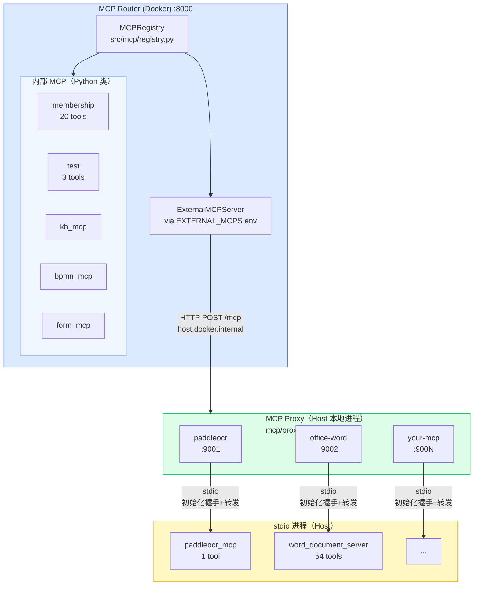

# MCP 配置和集成指南

## 概述

MCP (Model Context Protocol) 框架允许你集成多个服务的API命令，并通过统一的界面执行它们。系统中的MCP由 **MCPRegistry** 管理，可以注册多个MCP服务器。

## 当前配置

### 已注册的MCP服务器

系统启动时会自动注册以下MCP服务器：

**内部 MCP**（随 Router 进程启动，`src/main.py` 硬编码注册）：

| MCP名称 | 版本 | 工具数 | 用途 | 实现文件 |
|---------|------|--------|------|----------|
| `membership` | 2.0 | 20 | Membership API 命令 | `src/mcp_servers/membership_mcp.py` |
| `test` | 1.0 | 3 | 测试MCP示例 | `src/mcp_servers/test_mcp.py` |
| `kb_mcp` | 1.0.0 | — | 知识库查询 | `src/mcp_servers/kb_mcp.py` |
| `bpmn_mcp` | 1.0.0 | — | BPMN 流程生成 | `src/mcp_servers/bpmn_mcp.py` |
| `form_mcp` | 1.0.0 | — | 表单生成与验证 | `src/mcp_servers/form_mcp.py` |

**外部 MCP**（通过 `mcp/proxy` 代理接入，由 `EXTERNAL_MCPS` 环境变量配置）：

| MCP名称 | 工具数 | 用途 | 代理端口 |
|---------|--------|------|----------|
| `paddleocr` | 1 | 图像OCR识别 | 9001 |
| `office-word` | 54 | Word 文档操作 | 9002 |

## 架构



### 核心组件

#### 1. **BaseMCPServer** (`src/mcp/base_server.py`)
所有MCP服务器的基类

```python
class BaseMCPServer(ABC):
    def __init__(self, name: str, version: str)
    def register_tool(self, tool: Tool) -> None
    def execute_tool(self, tool_name: str, **kwargs) -> ToolResult
    def get_tools(self) -> List[Tool]
```

#### 2. **Tool** (`src/mcp/tool.py`)
代表单个可执行的工具/命令

```python
class Tool:
    def __init__(
        self,
        name: str,              # 工具唯一名称
        description: str,       # 工具描述
        input_schema: Dict,     # JSON Schema for input parameters
        handler: Callable       # Async handler function
    )
```

#### 3. **MCPRegistry** (`src/mcp/registry.py`)
管理所有注册的MCP服务器

```python
class MCPRegistry:
    def register_mcp(self, mcp: BaseMCPServer) -> None
    def get_mcp(self, mcp_name: str) -> Optional[BaseMCPServer]
    def execute_command(self, mcp_name: str, tool_name: str, **kwargs) -> ToolResult
```

#### 4. **ToolResult** (`src/mcp/result.py`)
工具执行的结果

```python
class ToolResult:
    @staticmethod
    def success(content: str) -> ToolResult
    @staticmethod
    def error(message: str, error_code: str) -> ToolResult
```

## 如何添加新的MCP服务器

根据场景选择接入方式：

| | 方式一：内部 MCP | 方式二：外部 MCP via 代理 |
|---|---|---|
| **适用** | 需要自定义逻辑、调用内部 HTTP API | 直接复用开源/第三方 MCP 包 |
| **示例** | membership、bpmn_mcp、form_mcp | paddleocr、office-word |
| **工作量** | 需编写 Python 类 | 只需修改两个配置文件 |
| **运行位置** | 随 Router 进程 | Host 本地进程（代理桥接） |

---

## 方式一：内部 MCP（自定义 Python 类）

### 步骤1：创建MCP服务器类

创建新文件 `src/mcp_servers/your_service_mcp.py`:

```python
from typing import Optional, Dict, Any
from ..mcp import BaseMCPServer, Tool, ToolResult
from ..services.http_client import HTTPClient
from ..core.config import settings
import logging

logger = logging.getLogger(__name__)

class YourServiceMCPServer(BaseMCPServer):
    """
    MCP server for Your Service API commands.
    """

    def __init__(self, tenant_id: Optional[int] = None, auth_token: Optional[str] = None):
        """
        Initialize the Your Service MCP server.

        Args:
            tenant_id: Tenant ID for API calls
            auth_token: Authorization token for API calls
        """
        super().__init__("your_service", "1.0")  # 设置MCP名称和版本
        self.tenant_id = tenant_id or settings.fixed_tenant_id
        self.auth_token = auth_token
        self.base_url = settings.your_service_url  # 需要在config中配置
        self.http_client = HTTPClient(base_url=self.base_url)
        self._register_tools()

    def _register_tools(self) -> None:
        """Register all Your Service API tools."""

        # Tool 1: List items
        self.register_tool(Tool(
            name="list_items",
            description="List all items",
            input_schema={
                "type": "object",
                "properties": {
                    "page": {
                        "type": "integer",
                        "description": "Page number (1-indexed)",
                        "default": 1
                    },
                    "limit": {
                        "type": "integer",
                        "description": "Number of items per page",
                        "default": 10
                    }
                }
            },
            handler=self.list_items
        ))

        # Tool 2: Get item by ID
        self.register_tool(Tool(
            name="get_item",
            description="Get details of a specific item",
            input_schema={
                "type": "object",
                "properties": {
                    "item_id": {
                        "type": "string",
                        "description": "Item ID"
                    }
                },
                "required": ["item_id"]
            },
            handler=self.get_item
        ))

        # Tool 3: Create item
        self.register_tool(Tool(
            name="create_item",
            description="Create a new item",
            input_schema={
                "type": "object",
                "properties": {
                    "name": {
                        "type": "string",
                        "description": "Item name"
                    },
                    "description": {
                        "type": "string",
                        "description": "Item description"
                    }
                },
                "required": ["name"]
            },
            handler=self.create_item
        ))

    async def list_items(self, page: int = 1, limit: int = 10, **kwargs) -> ToolResult:
        """List items handler."""
        try:
            response = await self.http_client.execute(
                command="GET /v1/items",
                params={
                    "query": {"page": page, "limit": limit}
                },
                auth_token=self.auth_token,
                tenant_id=self.tenant_id
            )
            return ToolResult.success(str(response))
        except Exception as e:
            logger.error(f"Error listing items: {e}")
            return ToolResult.error(str(e), error_code="LIST_ITEMS_ERROR")

    async def get_item(self, item_id: str, **kwargs) -> ToolResult:
        """Get item handler."""
        try:
            response = await self.http_client.execute(
                command="GET /v1/items/{id}",
                params={
                    "path": {"id": item_id}
                },
                auth_token=self.auth_token,
                tenant_id=self.tenant_id
            )
            return ToolResult.success(str(response))
        except Exception as e:
            logger.error(f"Error getting item: {e}")
            return ToolResult.error(str(e), error_code="GET_ITEM_ERROR")

    async def create_item(self, name: str, description: str = "", **kwargs) -> ToolResult:
        """Create item handler."""
        try:
            response = await self.http_client.execute(
                command="POST /v1/items",
                params={
                    "body": {"name": name, "description": description}
                },
                auth_token=self.auth_token,
                tenant_id=self.tenant_id
            )
            return ToolResult.success(str(response))
        except Exception as e:
            logger.error(f"Error creating item: {e}")
            return ToolResult.error(str(e), error_code="CREATE_ITEM_ERROR")
```

### 步骤2：更新config配置

在 `src/core/config.py` 中添加新服务的配置：

```python
from pydantic import Field

class Settings(BaseSettings):
    # ... 现有配置 ...

    # Your Service MCP configuration
    your_service_url: str = Field(default="http://localhost:9000", env="YOUR_SERVICE_URL")
```

### 步骤3：在main.py中注册MCP

编辑 `src/main.py`:

```python
from src.mcp_servers.your_service_mcp import YourServiceMCPServer

# 在 startup 事件中：
@app.on_event("startup")
async def startup_db_client():
    # ... 现有代码 ...

    # Initialize MCP Registry
    try:
        mcp_registry = MCPRegistry()

        # Register MCP servers
        membership_mcp = MembershipMCPServer()
        test_mcp = TestMCPServer()
        your_service_mcp = YourServiceMCPServer()  # 添加这一行

        mcp_registry.register_mcp(membership_mcp)
        mcp_registry.register_mcp(test_mcp)
        mcp_registry.register_mcp(your_service_mcp)  # 添加这一行

        # Set global MCP registry for dependency injection
        app.mcp_registry = mcp_registry

        logger.info(f"Initialized MCP Registry with {len(mcp_registry.get_all_mcps())} servers:")
        for mcp in mcp_registry.get_all_mcps():
            logger.info(f"  - {mcp.name} (v{mcp.version}): {len(mcp.get_tools())} tools")
    except Exception as e:
        logger.error(f"Failed to initialize MCP Registry: {e}")
```

---

## 方式二：外部 MCP via 代理（推荐用于第三方/开源 MCP）

适用于任何支持 **stdio 模式**的 MCP 包，无需修改其源码。代理（`mcp/proxy`）负责启动进程、处理握手、并将 stdio 转换为 HTTP/SSE 供 Router 调用。

### 步骤1：准备 MCP 包

将第三方 MCP 包放置于 `mcp/servers/<你的服务名>/`，确保可以用 `python -m <module>` 或直接运行脚本的方式以 **stdio** 模式启动。

```bash
# 验证能以 stdio 模式启动（有输出即可，Ctrl+C 退出）
cd mcp/servers/<你的服务名>
python -m <module_name>
# 或
python server.py
```

### 步骤2：在 mcp-proxy-config.yml 中添加服务

编辑 `mcp/proxy/config/mcp-proxy-config.yml`：

```yaml
servers:
  # ... 已有服务 ...

  - name: your-mcp          # 全局唯一名称，Router 用此名称引用
    port: 9003               # 选一个未被占用的端口（9001=paddleocr, 9002=office-word）
    cwd: ../../servers/your-mcp
    command: ["python"]
    args: ["-m", "your_mcp_module"]   # 或 ["server.py"]
    env:
      PYTHONUNBUFFERED: "1"  # 必须，确保 stdio 输出不缓冲
      # 其他服务所需环境变量...
```

> **端口分配约定**：9001=paddleocr，9002=office-word，新服务从 9003 递增。

### 步骤3：在 EXTERNAL_MCPS 中注册到 Router

编辑 `docker-compose.mcp-servers.yml`，在 `mcp-router` 服务的 `EXTERNAL_MCPS` 中追加新条目：

```yaml
environment:
  EXTERNAL_MCPS: >-
    {
      "paddleocr":{"transport":"http","url":"http://host.docker.internal:9001","timeout":300},
      "office-word":{"transport":"http","url":"http://host.docker.internal:9002","timeout":60},
      "your-mcp":{"transport":"http","url":"http://host.docker.internal:9003","timeout":60}
    }
```

`timeout` 单位为秒，OCR 等耗时操作建议设置 120~300。

### 步骤4：重启代理 + 重建 Router 容器

```bash
# 1. 停止并重启代理（Host 上运行）
# Ctrl+C 停止现有代理，然后：
cd mcp/proxy && python -m src

# 2. 重建 Router 容器（使 EXTERNAL_MCPS 新值生效）
docker-compose -f docker-compose.mcp-servers.yml up -d --force-recreate mcp-router
```

> ⚠️ **注意**：`docker restart` 不会更新环境变量，必须用 `--force-recreate`。

### 验证

```bash
# 查看 Router 日志，确认新 MCP 已被发现
docker logs mcp-router-dev 2>&1 | grep "your-mcp"

# 期望输出：
# Connected to HTTP MCP 'your-mcp': <server-name> v<version>
# Discovered N tools from HTTP MCP 'your-mcp'
```

---

## 使用MCP执行命令

### 方式1：通过ExecutionEngine（推荐用于任务规划）

```python
# 在执行计划时，系统会自动检查是否有对应的MCP
# 命令格式: "MCP_NAME.TOOL_NAME" 或 "GET /path"

# 如果命令是 "your_service.list_items"
# ExecutionEngine 会：
# 1. 解析 "your_service" 和 "list_items"
# 2. 从 MCPRegistry 获取 your_service MCP
# 3. 执行 list_items 工具
```

### 方式2：直接调用MCPRegistry

```python
from src.mcp.registry import MCPRegistry

# 获取registry实例（通常从app中）
mcp_registry: MCPRegistry = request.app.mcp_registry

# 执行命令
result = await mcp_registry.execute_command(
    mcp_name="your_service",
    tool_name="list_items",
    page=1,
    limit=10
)

if result.is_error:
    print(f"Error: {result.content}")
else:
    print(f"Success: {result.content}")
```

## 使用他人的MCP

### 场景：集成第三方MCP服务

假设要集成一个外部服务（如GitHub API）的MCP：

1. **创建适配器类**：
   ```python
   # src/mcp_servers/github_mcp.py
   class GitHubMCPServer(BaseMCPServer):
       def __init__(self, github_token: str):
           super().__init__("github", "1.0")
           self.github_token = github_token
           self.base_url = "https://api.github.com"
           self.http_client = HTTPClient(base_url=self.base_url)
           self._register_tools()
   ```

2. **注册工具**：
   ```python
   def _register_tools(self) -> None:
       # 为GitHub API的每个端点创建工具
       self.register_tool(Tool(
           name="get_repo",
           description="Get GitHub repository information",
           input_schema={...},
           handler=self.get_repo
       ))
   ```

3. **实现处理器**：
   ```python
   async def get_repo(self, owner: str, repo: str, **kwargs) -> ToolResult:
       try:
           response = await self.http_client.execute(
               command="GET /repos/{owner}/{repo}",
               params={"path": {"owner": owner, "repo": repo}},
               auth_token=self.github_token,
               tenant_id=1
           )
           return ToolResult.success(str(response))
       except Exception as e:
           return ToolResult.error(str(e))
   ```

4. **在main.py中注册**：
   ```python
   github_token = os.getenv("GITHUB_TOKEN")
   github_mcp = GitHubMCPServer(github_token)
   mcp_registry.register_mcp(github_mcp)
   ```

## 前端如何使用MCP

### 查看可用的MCP和工具

前端可以调用 `/v1/mcp/servers` 端点获取所有可用的MCP：

```bash
GET /v1/mcp/servers

Response:
{
  "servers": [
    {
      "name": "membership",
      "version": "2.0",
      "status": "running",
      "tools_count": 8,
      "tools": [
        {
          "name": "list_members",
          "description": "List all members",
          "input_schema": {...}
        },
        ...
      ]
    },
    {
      "name": "your_service",
      "version": "1.0",
      "status": "running",
      "tools_count": 3,
      "tools": [...]
    }
  ]
}
```

### 在任务规划中使用MCP

在创建执行计划时，可以指定使用哪个MCP的哪个工具：

```typescript
// plan2/src/components/PlannerExecutorPanel.tsx

const payload = {
    plan: [
        {
            step: 1,
            command: "membership.list_members",  // MCP 名称.工具名称
            description: "获取所有成员列表",
            params: {
                query: {
                    limit: 10
                }
            }
        },
        {
            step: 2,
            command: "your_service.get_item",
            description: "获取特定项目",
            params: {
                path: {
                    item_id: "item_123"
                }
            }
        }
    ],
    global_timeout: 60
};

const res = await api.post<ExecutionResponse>('/executions/', payload);
```

## 故障排除

### 1. MCP未被注册

**症状**：命令返回 "MCP not found for command"

**解决（内部 MCP）**：
- 检查 `src/main.py` 中是否注册了MCP
- 验证MCP名称拼写正确
- 检查日志确认MCP已初始化

**解决（外部 MCP via 代理）**：
- 确认代理正在运行：`curl http://localhost:9001/sse`（应返回 SSE 流）
- 确认 `EXTERNAL_MCPS` 包含该 MCP 名称（`docker inspect mcp-router-dev` 查看环境变量）
- Router 是否用 `--force-recreate` 重建？`docker restart` 不会更新环境变量

### 2. 工具未被发现

**症状**：工具存在但无法执行

**解决**：
- 验证工具名称在 `_register_tools()` 中正确注册
- 检查工具的 handler 函数是否定义
- 查看应用日志获取详细错误信息

### 3. 认证失败

**症状**：MCP执行返回401或403错误

**解决**：
- 验证 `auth_token` 和 `tenant_id` 正确传递
- 检查 HTTPClient 中的token刷新机制
- 确保MCP初始化时设置了正确的credentials

### 4. 外部 MCP 工具调用返回 -32602

**症状**：`Tool 'xxx' error: Invalid request parameters`，甚至 `tools/list` 也报错

**原因**：stdio 进程未完成 MCP 握手（`initialize` + `notifications/initialized`）

**解决**：检查代理日志中是否有 `stdio handshake OK`；若没有，代理版本可能过旧，重启代理

### 5. 外部 MCP 404 错误

**症状**：`HTTP MCP 'xxx' request failed: 404 Not Found`

**原因**：Router 使用 streamable-http（POST /mcp），但代理不支持该端点

**解决**：确认 `mcp/proxy` 目录使用的是最新代码（含 `POST /mcp` 端点），重启代理

## 性能优化建议

1. **缓存MCP信息**：前端可以缓存 `/v1/mcp/servers` 的响应，避免频繁请求
2. **异步执行**：所有工具处理器都是异步的，支持并发执行
3. **超时管理**：在计划中设置适当的 `global_timeout`
4. **错误恢复**：使用 Token刷新机制自动处理认证过期

## 参考文档

- [MCP框架文档](./docs/mcp/README.md)
- [MCP API参考](./docs/mcp/api-reference.md)
- [MCP开发指南](./docs/mcp/development-guide.md)
- [MCP架构详解](./docs/mcp/architecture.md)
