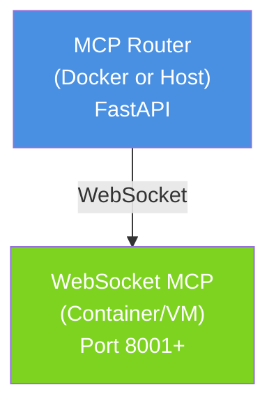
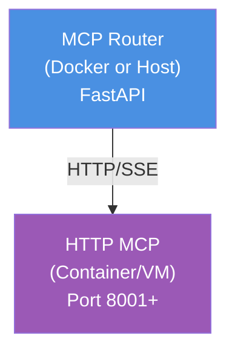
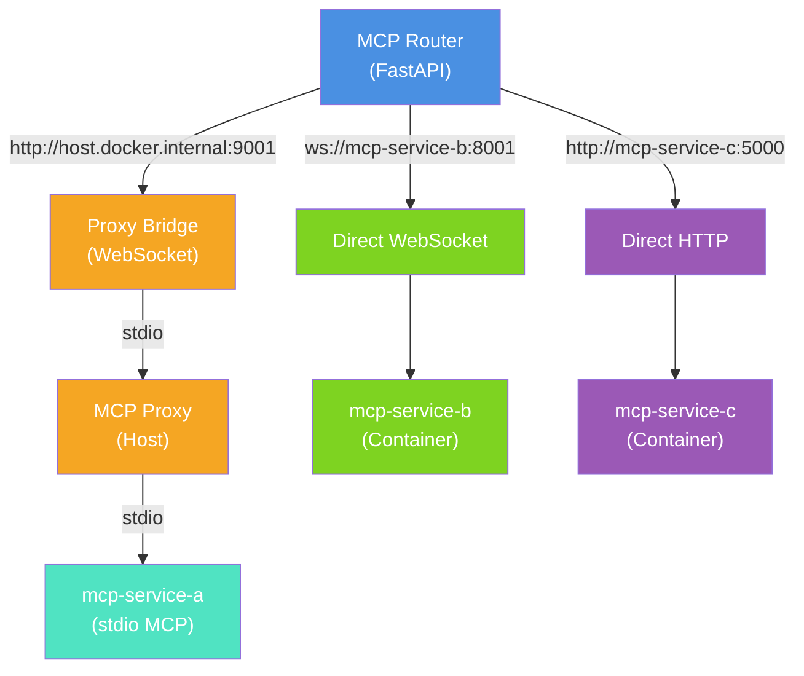

# AICMDEngine MCP Router 完整设计规范

## 1. 设计目标

**AICMDEngine Router** 需要支持接入多种外部 MCP 服务，这些服务可能部署在：
- Host 上（Python 进程）
- Docker 容器内（容器化服务）
- 远程机器（网络服务）

为了支持这些场景，Router 提供**三种连接方案**。

---

## 2. 三种 MCP 连接方案

### 方案 1️⃣：Proxy Bridge（代理桥接）

**适用于**：Host 上运行的 stdio MCP

**架构**：

```mermaid
graph TD
    A["MCP Router<br/>(Docker or Host)<br/>FastAPI"]
    B["MCP Proxy<br/>(Host)<br/>Port 9001-9003"]
    C["MCP Server<br/>(Python process)<br/>stdio"]
    
    A -->|HTTP/SSE<br/>(Legacy SSE)| B
    B -->|stdio<br/>IPC| C
    
    style A fill:#4A90E2,color:#fff
    style B fill:#F5A623,color:#fff
    style C fill:#7ED321,color:#fff
```

**优点**：
- ✅ Host 上的 stdio MCP 无需修改
- ✅ 多个 MCP 共享一个 Proxy，提高资源利用率
- ✅ Proxy 可单独部署和维护

**缺点**：
- ⚠️ Proxy 本身是单点（但可通过多实例解决）
- ⚠️ 多一层转换开销

**配置示例**：
```yaml
# docker-compose.mcp-servers.yml（假设通过 Proxy 连接）
EXTERNAL_MCPS: '{"mcp-service-a":{"transport":"http","url":"http://host.docker.internal:9001"}}'
```

---

### 方案 2️⃣：直接 WebSocket（容器化 WebSocket MCP）

**适用于**：容器化或远程 WebSocket MCP

**架构**：



**优点**：
- ✅ 直接连接，低延迟
- ✅ MCP 可独立部署和扩展
- ✅ 支持集群部署（负载均衡）

**缺点**：
- ⚠️ MCP 必须实现 WebSocket 协议
- ⚠️ 每个 MCP 需要单独管理

**配置示例**：
```yaml
EXTERNAL_MCPS: '{"mcp-service-a":{"transport":"websocket","url":"ws://mcp-service-a:8001"}}'
```

> **注意**：直接 WebSocket 方案要求对端 MCP 实现 WebSocket 协议，transport 值保持 `websocket`。

```yaml
```

---

### 方案 3️⃣：直接 HTTP/SSE（容器化 HTTP MCP）

**适用于**：容器化或远程 HTTP/SSE MCP

**架构**：



**优点**：
- ✅ 最灵活（任何 HTTP API 都可作为 MCP）
- ✅ 易于部署和扩展
- ✅ 支持多种框架

**缺点**：
- ⚠️ Router 需要实现 HTTP/SSE 客户端（目前未实现）
- ⚠️ 相比 WebSocket 有略高的请求开销

**配置示例**：
```yaml
EXTERNAL_MCPS: '{"mcp-service-a":{"transport":"http","url":"http://mcp-service-a:8001"}}'
```

---

## 3. 统一的配置规范

### EXTERNAL_MCPS 环境变量格式

**位置**：`docker-compose.mcp-servers.yml` 或任何启动 Router 的地方

**格式**：JSON 字符串（单行，避免 YAML 破坏），结构如下：

```json
{
  "mcp_name": {
    "transport": "websocket|http|stdio",
    "url": "ws://|http://|unix://...",
    "timeout": 30,
    "headers": {},
    "command": "...",
    "args": [],
    "env": {}
  }
}
```

### 配置参数说明

| 参数 | 必需 | 类型 | 说明 | 示例 |
|------|------|------|------|------|
| `transport` | ✅ | string | 连接方式：`http` / `websocket` / `stdio` | `"http"` |
| `url` | ❌ | string | 服务地址（http/websocket 必需） | `"http://host:9001"` |
| `timeout` | ❌ | integer | 连接超时（秒），默认 30 | `30` |
| `headers` | ❌ | object | HTTP 请求头（http 可用） | `{"Authorization":"Bearer ..."}` |
| `command` | ❌ | string | 启动命令（stdio 必需） | `"python -m mcp"` |
| `args` | ❌ | array | 启动参数（stdio 可用） | `["--host", "0.0.0.0"]` |
| `env` | ❌ | object | 环境变量（stdio 可用） | `{"PYTHONPATH": "/app"}` |

### 完整配置示例

```yaml
# docker-compose.mcp-servers.yml
EXTERNAL_MCPS: '{"mcp-service-a":{"transport":"http","url":"http://host.docker.internal:9001","timeout":30},"mcp-service-b":{"transport":"websocket","url":"ws://mcp-service-b:8001"},"mcp-service-c":{"transport":"http","url":"http://mcp-service-c:5000","headers":{"X-API-Key":"secret"}}}'
```

**推荐方式**：分多行写（可读性更好）：
```bash
# 格式化后（用于说明，实际需转成单行）
{
  "mcp-service-a": {
    "transport": "http",
    "url": "http://host.docker.internal:9001",
    "timeout": 30
  },
  "mcp-service-b": {
    "transport": "websocket",
    "url": "ws://mcp-service-b:8001"
  },
  "mcp-service-c": {
    "transport": "http",
    "url": "http://mcp-service-c:5000",
    "headers": {"X-API-Key": "secret"}
  }
}
```

---

## 4. 部署场景对应表

### 场景 A：Host Proxy + 容器 Router（当前主要场景）

```yaml
# 在 docker-compose 中：
- MCP Proxy 在 Host 上运行（Python 进程）
  - 命令：cd /mcp/proxy && python -m src
  - 监听：0.0.0.0:9001, 9002, 9003（stdio MCP 对应）

- Router 在 Docker 中运行
  - 需要访问 Host 的 Proxy
  - 使用 host.docker.internal:9001 地址

配置示例：
EXTERNAL_MCPS: '{"mcp-service-a":{"transport":"http","url":"http://host.docker.internal:9001"}}'
```

### 场景 B：完全容器化（推荐生产方案）

```yaml
# 在 docker-compose 中：
services:
  # Router 服务
  mcp-router:
    image: aicmdengine:latest
    environment:
      EXTERNAL_MCPS: '{"mcp-service-a":{"transport":"websocket","url":"ws://mcp-service-a:8001"},"mcp-service-b":{"transport":"websocket","url":"ws://mcp-service-b:8001"}}'
    
  # 直接容器化的 MCP 服务
  mcp-service-a:
    image: your-mcp-service-a-image:latest
    ports:
      - "8001:8001"
    environment:
      MCP_TRANSPORT: "websocket"
      MCP_PORT: "8001"
  
  mcp-service-b:
    image: your-mcp-service-b-image:latest
    ports:
      - "8002:8001"
    environment:
      MCP_TRANSPORT: "websocket"
      MCP_PORT: "8001"
```

### 场景 C：混合部署（多种连接方式并存）

**适用于**：同时存在多种部署形式的 MCP 服务

**架构**：



**使用场景**：
- ✅ 系统逐步容器化过程中（既有 Host MCP 又有容器化 MCP）
- ✅ 多个团队独立维护 MCP 服务（不同部署方式）
- ✅ 灾备和冗余（同时使用备份服务）
- ✅ A/B 测试（多个版本的同一个 MCP 并存）

**优点**：
- ✅ 最灵活，可以混用各种部署形式
- ✅ 支持平滑迁移（逐步从 Host 迁到容器）
- ✅ 降低迁移风险（可以并行运行新旧版本）

**缺点**：
- ⚠️ 运维成本高（需要管理多种部署形式）
- ⚠️ 网络拓扑复杂（需要考虑跨主机通信）
- ⚠️ 故障可能涉及多层（难以定位问题）

**配置示例**：

```yaml
# docker-compose.mcp-servers.yml
environment:
  EXTERNAL_MCPS: '{"paddleocr":{"transport":"http","url":"http://host.docker.internal:9001","timeout":30},"office":{"transport":"websocket","url":"ws://office-mcp:8001","timeout":30},"custom-api":{"transport":"http","url":"http://api-server:5000","timeout":30,"headers":{"X-API-Key":"secret"}}}'
```

**混合部署的三种连接方式说明**：

| MCP | Transport | 位置 | 说明 |
|-----|-----------|------|------|
| **mcp-service-a** | HTTP/SSE | Host Proxy | 通过 Proxy 桥接（Legacy SSE），stdio MCP 运行在 Host 上 |
| **mcp-service-b** | WebSocket | 容器 | 容器内直接提供 WebSocket 服务 |
| **mcp-service-c** | HTTP | 容器 | 容器内提供 HTTP/REST API，Router 通过 HTTP 调用 |

**关键配置要点**：

1. **Host Proxy 的 MCP**（mcp-service-a）：
   - Transport: `http`（Legacy SSE 协议：`GET /sse` + `POST /messages`）
   - URL: `http://host.docker.internal:9001`（Router 通过 Docker 访问 Host 上的 Proxy）
   - Proxy 端口 9001 对应 mcp/proxy/config/mcp-proxy-config.yml 中的配置

2. **容器化 WebSocket MCP**（mcp-service-b）：
   - Transport: `websocket`
   - URL: `ws://mcp-service-b:8001`（Docker Compose 网络内直接访问）
   - mcp-service-b 容器必须暴露 WebSocket 服务

3. **容器化 HTTP MCP**（mcp-service-c）：
   - Transport: `http`
   - URL: `http://mcp-service-c:5000`
   - mcp-service-c 容器必须暴露 HTTP 服务
   - 可选：headers（用于认证等）

**混合部署时的注意事项**：

1. **网络隔离**：
   - Proxy 在 Host 上，需要 Router 能访问（用 `host.docker.internal`）
   - 其他 MCP 容器需要加入同一 Docker Compose 网络

2. **故障排查**：
   - 验证 Proxy 是否运行：`ps aux | grep "python -m src"`
   - 验证 Proxy 端口是否开放：`lsof -i :9001`
   - 验证 Router 能否访问 Proxy：进入 Router 容器执行 `curl http://host.docker.internal:9001/sse --max-time 2`
   - 验证容器间网络：进入 Router 容器执行 `ping mcp-service-b`

3. **性能考虑**：
   - Proxy Bridge 方式有额外的转换开销
   - WebSocket 和 HTTP 连接各有开销
   - 可根据使用频率选择适合的连接方式

4. **迁移策略**：
   ```
   阶段 1：Host Proxy Bridge（全部通过 Proxy）
           └─ mcp-service-a (Proxy)
   
   阶段 2：混合部署（逐步容器化）
           ├─ mcp-service-a (Proxy) [旧]
           ├─ mcp-service-b (WebSocket Container) [新]
           └─ mcp-service-c (HTTP Container) [新]
   
   阶段 3：完全容器化（所有 MCP 容器部署）
           ├─ mcp-service-a (WebSocket Container)
           ├─ mcp-service-b (WebSocket Container)
           └─ mcp-service-c (HTTP Container)
   ```

---

## 5. 代码实现需求

### ExternalMCPServer（位置：`src/mcp/external_mcp.py`）

**当前状态**：
- ✅ `stdio`：完整实现
- ✅ `websocket`：完整实现
- ❌ `http` / `http-bridge` / `sse`：**需要实现**

**实现要点**：

```python
class ExternalMCPServer:
    async def initialize(self) -> None:
        if self.transport == "stdio":
            await self._connect_stdio()
        elif self.transport == "websocket":
            await self._connect_websocket()
        elif self.transport in ("http", "http-bridge", "sse"):
            await self._connect_http()  # ← 需要新增
        else:
            raise ValueError(f"Unsupported transport: {self.transport}")
    
    async def _connect_http(self) -> None:
        """
        通过 HTTP/SSE 连接外部 MCP
        
        实现方案：
        1. 工具发现：向 MCP 发送 /tools GET 请求
        2. 工具调用：向 MCP 发送 /tools/{tool_name} POST 请求
        3. 资源访问：向 MCP 发送 /resources GET 请求
        4. SSE 支持：监听 /events SSE 端点（可选）
        """
        pass
```

**关键接口**：
- `GET /tools`：返回可用工具列表
- `POST /tools/{tool_name}`：调用工具
- `GET /resources`：获取资源列表
- `GET /events`：SSE 事件流（可选）

---

## 6. docker-compose 配置最佳实践

### ❌ 错误方式（YAML `>` 破坏 JSON）

```yaml
EXTERNAL_MCPS: >
  {"paddleocr":{"transport":"http","url":"http://host.docker.internal:9001"}}
```

### ✅ 正确方式 1：单行 JSON

```yaml
EXTERNAL_MCPS: '{"paddleocr":{"transport":"http","url":"http://host.docker.internal:9001"},"office":{"transport":"http","url":"http://host.docker.internal:9002"}}'
```

### ✅ 正确方式 2：使用 JSON 文件（推荐）

```yaml
# docker-compose.mcp-servers.yml
services:
  mcp-router:
    environment:
      EXTERNAL_MCPS_FILE: /app/config/external_mcps.json
    volumes:
      - ./config/external_mcps.json:/app/config/external_mcps.json:ro
```

```json
// config/external_mcps.json
{
  "paddleocr": {
    "transport": "http",
    "url": "http://host.docker.internal:9001",
    "timeout": 300
  },
  "office-word": {
    "transport": "http",
    "url": "http://host.docker.internal:9002"
  }
}
```

---

## 7. 迁移路径

### 第一阶段（当前）
- ✅ 支持 Proxy Bridge（websocket transport）
- ✅ 支持直接 WebSocket（websocket transport）
- ✅ 修复 docker-compose 配置

### 第二阶段
- 🔄 实现 HTTP/SSE 支持（http transport）
- 🔄 更新文档和示例

### 第三阶段（可选）
- 将 Proxy 改为可选（完全容器化）
- 支持负载均衡和 MCP 服务发现

---

## 8. 网络配置参考

### Docker 内部通信

**Router 访问 Host 上的 Proxy**：
```yaml
# 方式 1：host.docker.internal（Docker Desktop / Mac / Windows）
url: "http://host.docker.internal:9001"

# 方式 2：显式网关地址（Linux）
url: "http://172.17.0.1:9001"

# 方式 3：host 网络模式（Linux，需要特权）
network_mode: "host"
```

**Router 访问其他容器（WebSocket MCP）**：
```yaml
# 使用容器名作为 DNS（Docker Compose 自动支持）
url: "ws://paddleocr-mcp:8001"
```

---

## 总结

| 连接方法 | 部署模式 | 优点 | 缺点 | Status |
|---------|---------|------|------|--------|
| **Proxy Bridge (HTTP/SSE)** | Host Proxy + stdio MCP | 兼容 stdio MCP，无需修改 | 多层转换 | ✅ |
| **直接 WebSocket** | 容器化 WS MCP | 直接、快速 | MCP需实现WS协议 | ✅ |
| **直接 HTTP/SSE** | 容器化 HTTP MCP | 最灵活 | — | ✅ |

**当前状态**：
1. ✅ 确认设计规范（本文档）
2. ✅ docker-compose 配置使用单行 JSON
3. ✅ HTTP/SSE 支持已实现（ExternalMCPServer `_connect_http`）
4. ✅ MCP Proxy 使用 HTTP/SSE（Legacy SSE：`GET /sse` + `POST /messages`）
