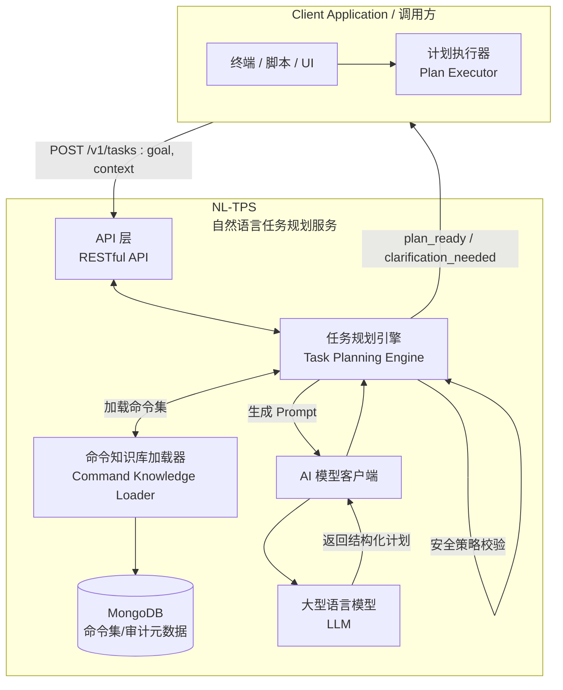

# 自然语言任务规划服务 (NL-TPS) - 系统设计规范 v1.0

## 1. 概述

### 1.1. 服务定位

自然语言任务规划服务（Natural Language - Task Planning Service, NL-TPS）是一个独立的、AI驱动的智能中间件。其核心职责是将用户以自然语言描述的**高阶任务目标**，转换为一个由原子命令组成的、结构化的、有序的**可执行计划**。

**本服务自身不执行任何命令**。它扮演“任务规划大脑”的角色，将执行的细节和控制权完全交给调用方。

### 1.2. 核心解决的问题

*   **降低人机交互门槛**：用户无需学习复杂的 API 或命令行语法，只需用自然语言描述其最终目的。
*   **自动化复杂工作流**：将需要多个步骤、存在逻辑依赖的复杂任务，自动化地编排成机器可执行的序列。
*   **解耦意图与执行**：将“用户想做什么”（意图）与“系统该怎么做”（执行）彻底分离，使上层业务逻辑和底层命令执行可以独立演进。

### 1.3. 设计原则

*   **单一职责**：专注于“规划”，不参与“执行”。
*   **无状态服务**：核心处理逻辑是无状态的，便于水平扩展。会话状态由调用方管理或通过外部缓存实现。
*   **声明式命令**：通过外部注册的命令集（如 OpenAPI 规范）作为规划的“知识库”。
*   **AI 驱动**：深度利用大型语言模型（LLM）的语义理解、逻辑推理和任务分解能力。

## 2. 系统架构



**工作流程:**

1.  **接收任务**: 调用方将用户的自然语言目标（如 "在研发部加入一个叫张三的新员工"）通过 `POST /v1/tasks` 发送给 NL-TPS。
2.  **加载知识**: 任务规划引擎根据**解析后的租户身份**（见第6节安全策略），从 MongoDB 加载该租户专属的命令集。
    *   *优化策略*：对于大型命令集，使用 **向量检索 (Vector Search)** 根据用户目标语义检索 Top-N 个最相关的命令，而非加载全部。
3.  **生成 Prompt**: 引擎将用户目标和加载的命令集组合成一个精心设计的 Prompt，发送给 LLM。
4.  **AI 规划**: LLM 根据 Prompt 指示，将任务分解成一个包含步骤、参数和依赖关系的 JSON 计划。
5.  **安全校验与返回**: 引擎对生成的计划进行**风险评估**（检查是否包含高危命令）。最后将计划封装成 `plan_ready` 响应（含风险等级）返回给调用方。

**容错与性能要点:**

*   命令集加载优先走内存/本地缓存并设置过期时间，Mongo 不可用时可读只读副本。
*   LLM 调用设置超时、重试与指数退避，必要时切换备用模型/供应商或返回明确错误码。
*   Prompt 构建与解析均做输入校验和 JSON Schema 校验，失败路径要可观测（日志/指标/Audit）。

## 3. 数据模型 (MongoDB)

采用两个集合来存储和管理命令。

### 3.1. `command_sets` 集合

存储命令集的元信息，用于组织和隔离。

**Schema:**

```json
{
  "_id": "ObjectId",      // 主键
  "name": "String",         // 命令集名称，需唯一，如 "membership-api-v2.4"
  "description": "String",  // 命令集描述
  "tenantId": "String",     // 所属租户ID，用于多租户隔离
  "sourceType": "String",   // 来源类型, 如 "openapi", "manual"
  "sourceUri": "String",    // 来源地址, 如 OpenAPI 文件的 URL
  "version": "String",      // 版本号
  "createdAt": "Date",
  "updatedAt": "Date"
}
```

### 3.2. `commands` 集合

存储具体的原子命令定义。

**Schema:**

```json
{
  "_id": "ObjectId",          // 主键
  "commandSetId": "ObjectId", // 外键，关联到 command_sets._id
  "tenantId": "String",         // 冗余租户ID，便于查询
  "command": "String",          // 命令唯一标识, 推荐使用 "METHOD /path/template", 如 "POST /v2/members/{id}/roles"
  "summary": "String",          // 命令摘要/一句话描述，如 "给成员分配角色"
  "description": "String",      // 详细描述
  "tags": ["String"],           // 分类标签，如 ["Members", "Roles"]
  "parameters": [               // 参数定义
  "riskLevel": "String",        // [新增] 风险等级: "normal" (默认), "high" (需确认), "critical" (高危)
    {
      "name": "String",         // 参数名, 如 "id", "status"
      "in": "String",           // 参数位置, "path", "query", "header", "body"
      "description": "String",  // 参数的自然语言描述
      "required": "Boolean",
      "schema": {               // 参数的类型和约束 (JSON Schema)
        "type": "String",       // "string", "integer", "boolean", "object", "array"
        "enum": ["String"],
        "properties": {}        // 对于 object 类型
      }
    }
  ],
  "examples": ["String"],       // 更多自然语言示例，用于增强AI理解
  "createdAt": "Date",
  "updatedAt": "Date"
}
```

### 3.3. 命令集来源与治理原则

*   **来源可插拔**：NL-TPS 只要求“结构化命令集”，不依赖 OpenAPI。支持自定义 YAML/JSON、GraphQL SDL、gRPC proto、内部 DSL 或手工维护清单。OpenAPI 只是常见导入器示例，不是强依赖。
*   **治理字段**：推荐在命令集元信息中补充 `version`、`owner`、`tenantScope`/`visibility`、`preconditions`（权限、前置调用）、`rateLimitHint` 等，便于审计、灰度与容量规划。
*   **演进与回滚**：当上游契约（无论来源格式）新增/删除字段或路径调整时，需生成新的命令集版本，支持按租户/调用方灰度并保留快速回滚路径。
*   **权限对齐**：将来源契约中的安全声明或标签映射到命令集的可见性/前置校验字段，规划时只加载调用方已授权的命令。

## 4. AI Prompt 核心设计

Prompt 是驱动 AI 进行正确规划的关键。它必须教会 AI 如何思考。

**模板结构:**

```text
# ROLE
You are an expert AI Task Planner. Your goal is to convert a user's high-level objective into a precise, step-by-step execution plan based on a given set of available commands. You must think step-by-step and identify dependencies.

# COMMANDS
Here are the available commands you can use. Each command is an API endpoint.

${command_definitions_json}

# TASK
User's objective: "${user_goal}"

# INSTRUCTIONS
1.  **Decomposition**: Break down the user's objective into a sequence of logical steps.
2.  **Command Mapping**: For each step, find the most appropriate command from the available COMMANDS.
3.  **Parameter Extraction**: Extract all necessary parameters for each command from the user's objective.
4.  **Dependency Identification**: If a step requires information from a previous step's result (e.g., using a newly created member's ID), you MUST specify this dependency using JSONPath syntax (e.g., "$.steps[0].response.body.id").
5.  **Existence Check**: If the user's objective implies operating on an existing entity (e.g., "in the 'R&D' department"), your plan should first include a step to search for that entity's ID (e.g., using a GET command with a filter).
6.  **Output Format**: Respond ONLY with a valid JSON object adhering to the following schema. Do not add any explanations outside the JSON structure.

# OUTPUT_SCHEMA
{
  "confidence": "A score from 0.0 to 1.0 indicating your confidence in the generated plan.",
  "plan": [
    {
      "step": "Integer, starting from 1.",
      "description": "A brief, human-readable description of what this step does.",
      "command": "The unique identifier of the command to be executed (e.g., 'POST /v2/members').",
      "params": {
        "pathParams": { "key": "value or JSONPath expression" },
        "queryParams": { "key": "value or JSONPath expression" },
        "body": { "key": "value or JSONPath expression" }
      }
    }
  ],
  "question": "If the user's objective is ambiguous or missing critical information to create a complete plan, ask a clarifying question here. Otherwise, this should be null."
}

# RESPONSE
```

### 4.1. Prompt 生成与校验流程

1.  **命令集过滤**：根据 `tenantId`、`commandSetNames`、调用方权限过滤可用命令集，按 `version`/优先级选择最新有效集合。
2.  **上下文检索 (RAG)**：使用 Embedding 模型计算用户目标的向量，从命令集中检索语义最相关的 Top-N 个命令（及对应的 Few-shot 示例），解决上下文窗口限制并提升准确率。
3.  **模型与超参**：按场景选择模型（如 gpt-4 规划 vs. gpt-3.5 兜底），统一温度、max_tokens、超时配置，设置重试与指数退避。
4.  **安全防护**：对 `goal` 做输入校验和 Prompt 注入检测（黑名单/长度/正则），上下文和示例做 HTML/JSON escaping。
5.  **结果校验**：对 LLM 输出做 JSON Schema 校验，缺失字段或格式错误时尝试一次自我修复；仍失败则返回 `clarification_needed` 或错误码。
6.  **降级与记录**：LLM 超时/多次失败时返回明确错误码并记录审计，包含模型、耗时、重试次数和成本。

## 5. REST API 规范

**Base Path:** `/v1`

### 5.1. 命令集管理

*   `POST /command-sets`: 创建一个新的命令集。
*   `GET /command-sets`: 查询命令集列表。
*   `POST /command-sets/{setId}/commands`: 在指定命令集中注册一个新命令。
*   `GET /command-sets/{setId}/commands`: 查询指定命令集下的所有命令。
*   `DELETE /command-sets/{setId}`: 删除一个命令集及其所有命令。

### 5.2. 任务规划

这是服务的核心端点。

`POST /tasks`

**Request Body:**

```json
{
  "goal": "String", // 必需，用户的自然语言任务目标
  "context": {      // 可选，提供执行上下文
    "tenantId": "String", // 可选。在专属服务模式下由后端配置决定；公共模式下需与 Header 保持一致
    "commandSetNames": ["String"], // 限定在此命令集范围内规划
    "userId": "String"
  }
}
```

**Success Response (200 OK): `plan_ready`**

```json
{
  "type": "plan_ready",
  "confidence": 0.95,
  "risk_assessment": {  // [新增] 风险评估结果
    "level": "high",    // "normal" | "high" | "critical"
    "message": "此计划包含不可逆的删除操作，请仔细核对。"
  },
  "plan": [
    {
      "step": 1,
      "description": "首先，查找名为'研发部'的组织的ID",
      "command": "GET /v2/orgs",
      "params": {
        "queryParams": { "keyword": "研发部" }
      }
    },
    {
      "step": 2,
      "description": "然后，创建名为'张三'的新成员",
      "command": "POST /v2/members",
      "params": {
        "body": {
          "username": "zhangsan",
          "fullName": "张三",
          "email": "zhangsan@example.com"
        }
      }
    },
    {
      "step": 3,
      "description": "最后，将新成员关联到'研发部'",
      "command": "POST /v2/members/{id}/orgs",
      "params": {
        "pathParams": {
          "id": "$.steps[1].response.body.id" // 依赖第2步创建的成员ID
        },
        "body": {
          "org_id": "$.steps[0].response.body.data[0].id" // 依赖第1步查到的组织ID
        }
      }
    }
  ]
}
```

**Success Response (200 OK): `clarification_needed`**

```json
{
  "type": "clarification_needed",
  "confidence": 0.4,
  "question": "您是指哪个'研发部'？我们系统中有'上海研发部'和'北京研发部'。"
}
```

**Error Response (4xx/5xx):**

```json
{
  "error_code": "NO_COMMAND_SET_FOUND",
  "error_message": "未找到与租户 'tenant-123' 关联的命令集。"
}
```

### 5.3. 任务生命周期与回调

*   **任务标识**：推荐在 `plan_ready` / `clarification_needed` 响应中返回 `taskId`、`planVersion`，便于调用方记录与重试。`planVersion` 对应命令集版本或 prompt 模式。
*   **状态流转**：`created` → `planned`（含 plan）或 `clarification_needed`，失败进入 `failed`，可按 `taskId` 重新触发规划或撤销。
*   **获取计划**：除同步返回外，可提供 `GET /tasks/{taskId}` 查询最新计划或澄清问题，便于异步执行器轮询或回调。
*   **回调可选**：如需推送模式，可约定 `callbackUrl`，规划完成后回调携带 `taskId`、`planVersion`、`plan` 或 `question`。
*   **错误码覆盖**：除示例错误外，应补充如 `LLM_TIMEOUT`、`PLAN_VALIDATION_FAILED`、`NO_AVAILABLE_COMMANDS`、`PERMISSION_DENIED` 等，以便调用方做幂等/重试策略。

## 6. 安全与运维

NL-TPS 不再单独实现安全与运维能力，而是**直接复用成员管理系统（Membership）**现有的认证、审计和观测堆栈。调用方需按照《docs/MEMBERSHIP_USAGE_MANUAL.md》及 `docs/membership_v2.4_openapi.yaml` 的约定进行接入。整体责任划分如下：

1. **认证 / 授权链路**：所有进入 NL-TPS 的请求必须先通过 Membership 的 Auth 组件获取 `Bearer Token`。**租户上下文解析**由服务启动配置 `SERVICE_TENANT_ID` 决定：
    *   **公共服务模式** (`SERVICE_TENANT_ID=0`)：服务作为系统级公共设施运行。请求**必须**携带 `X-Tenant-ID` 头以动态指明当前业务租户。
    *   **专属服务模式** (`SERVICE_TENANT_ID!=0`)：服务作为特定租户（如私有化部署）的专属资源运行。请求头 `X-Tenant-ID` 若存在则**必须与配置一致**，否则拒绝访问；若省略则默认使用配置的 ID。
    NL-TPS 仅校验令牌有效性与租户一致性，其余用户生命周期、客户端凭证、OTP、自动登录等均由 Membership 负责。
2. **多租户隔离与 RBAC**：租户、组织、角色、权限完全沿用 Membership 模型（手册 4.3、6.x 节）。NL-TPS 接口根据 `tenantId` 与 token claim 推断调用方上下文，并在规划时仅加载相应租户被授权的命令集。命令执行权限交由调用方结合 Membership 的 `/v2/permissions/check` 等接口裁决。
3. **审计合规**：所有规划请求及 AI 调用元数据写入 Membership 的 `audit_outbox` 流（水位、令牌、planId、置信度、LLM 成本等）。合规团队可复用现有 Kafka/Mongo 订阅与运维面板，无需在 NL-TPS 中重复实现审计链路。
4. **运维与可观测性**：指标体系（Prometheus）、结构化日志、告警、灰度与速率限制均复用 Membership 平台的 SRE 规范。NL-TPS 仅需暴露基础运行指标（如 LLM 延迟、Prompt 错误），并将其作为 Membership 的子系统注册到 `settings/observability` 配置中。
5. **安全基线**：输入校验、Prompt 注入检测、敏感字段脱敏等按 Membership 安全部门发布的基线执行；密钥与 LLM Provider 凭证纳入 Membership 统一的 Secret 管理（Vault/KMS）。
6. **运维指标与 SLO**：NL-TPS 应上报核心指标（如 `tasks_received_total`、`llm_latency_ms`、`plan_validation_fail_total`、`llm_retry_total`），并按 Membership SLO 模板配置告警；审计日志与留存周期沿用 Membership 统一策略，无需单独定义。

通过上述方式，NL-TPS 可以聚焦在“任务规划”核心能力，同时享受 Membership 在认证、合规、运维方面的成熟保障。未来如 Membership 安全策略升级，只需更新共用文档和配置即可联动生效。
