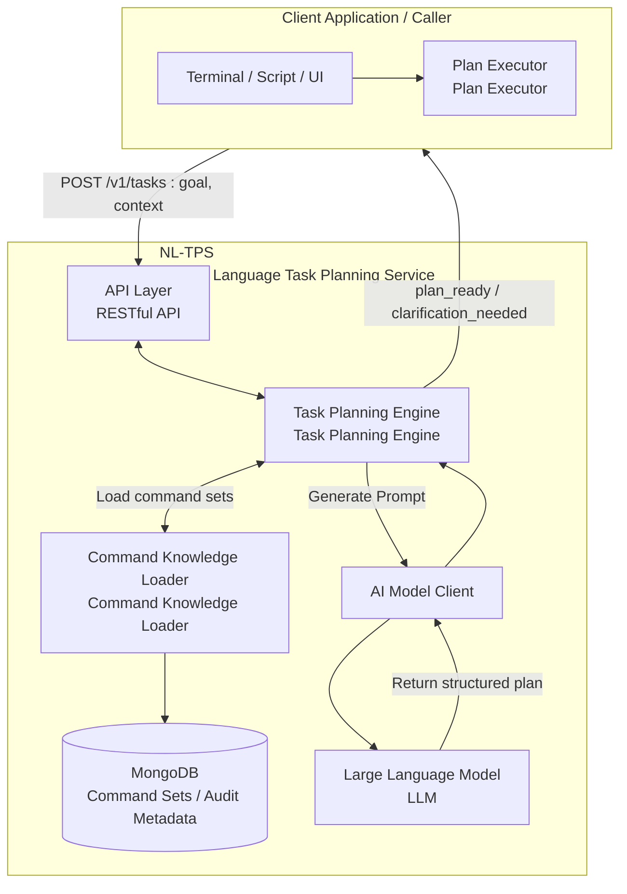

# Natural Language Task Planning Service (NL-TPS) - System Design Specification v1.0

## 1. Overview

### 1.1. Service Positioning

The Natural Language Task Planning Service (NL-TPS) is an independent, AI-driven intelligent middleware. Its core responsibility is to transform user-provided high-level task objectives described in natural language into a structured, ordered, and executable plan composed of atomic commands.

**This service does not execute any commands itself.** It plays the role of a "task planning brain," delegating execution details and control completely to the caller.

### 1.2. Core Problems Addressed

*   **Lowering Human-Machine Interaction Barriers**: Users no longer need to learn complex APIs or command-line syntax; they only need to describe their final objective in natural language.
*   **Automating Complex Workflows**: Automatically orchestrates complex tasks requiring multiple steps with logical dependencies into machine-executable sequences.
*   **Decoupling Intent from Execution**: Completely separates "what the user wants to do" (intent) from "how the system should do it" (execution), allowing upper-layer business logic and lower-layer command execution to evolve independently.

### 1.3. Design Principles

*   **Single Responsibility**: Focus exclusively on "planning," not "execution."
*   **Stateless Service**: Core processing logic is stateless for easy horizontal scaling. Session state is managed by the caller or implemented via external caching.
*   **Declarative Commands**: Leverages externally registered command sets (e.g., OpenAPI specifications) as the "knowledge base" for planning.
*   **AI-Driven**: Deeply utilizes Large Language Models (LLM) for semantic understanding, logical reasoning, and task decomposition.

## 2. System Architecture



**Workflow:**

1.  **Receive Task**: The caller sends the user's natural language objective (e.g., "Add a new employee named Zhang San to the R&D department") to NL-TPS via `POST /v1/tasks`.
2.  **Load Knowledge**: The task planning engine loads relevant command sets from MongoDB based on the **resolved tenant identity** (see Section 6 Security).
3.  **Generate Prompt**: The engine combines the user's objective and loaded command sets into a carefully crafted prompt and sends it to the LLM.
4.  **AI Planning**: The LLM decomposes the task into a JSON plan containing steps, parameters, and dependency relationships according to the prompt instructions.
5.  **Return Plan**: NL-TPS encapsulates the plan returned by the AI into a `plan_ready` response and returns it to the caller. The caller's "plan executor" is responsible for parsing and executing this plan.

**Fault Tolerance and Performance Key Points:**

*   Command set loading prioritizes in-memory/local caching with expiration, and can read read-only replicas if MongoDB is unavailable.
*   LLM calls set timeouts, retries, and exponential backoff; if necessary, switch to backup models/providers or return clear error codes.
*   Both prompt construction and parsing perform input validation and JSON Schema validation, with observable failure paths (logs/metrics/audit).

## 3. Data Model (MongoDB)

Two collections are used to store and manage commands.

### 3.1. `command_sets` Collection

Stores metadata of command sets for organization and isolation.

**Schema:**

```json
{
  "_id": "ObjectId",      // Primary key
  "name": "String",         // Command set name, must be unique, e.g., "membership-api-v2.4"
  "description": "String",  // Command set description
  "tenantId": "String",     // Owning tenant ID for multi-tenant isolation
  "sourceType": "String",   // Source type, e.g., "openapi", "manual"
  "sourceUri": "String",    // Source address, e.g., URL of OpenAPI file
  "version": "String",      // Version number
  "createdAt": "Date",
  "updatedAt": "Date"
}
```

### 3.2. `commands` Collection

Stores concrete atomic command definitions.

**Schema:**

```json
{
  "_id": "ObjectId",          // Primary key
  "commandSetId": "ObjectId", // Foreign key, references command_sets._id
  "tenantId": "String",         // Redundant tenant ID for query convenience
  "command": "String",          // Unique command identifier, recommended format "METHOD /path/template", e.g., "POST /v2/members/{id}/roles"
  "summary": "String",          // One-line command summary, e.g., "Assign role to member"
  "description": "String",      // Detailed description
  "tags": ["String"],           // Classification tags, e.g., ["Members", "Roles"]
  "parameters": [               // Parameter definitions
    {
      "name": "String",         // Parameter name, e.g., "id", "status"
      "in": "String",           // Parameter location, "path", "query", "header", "body"
      "description": "String",  // Natural language description of the parameter
      "required": "Boolean",
      "schema": {               // Parameter type and constraints (JSON Schema)
        "type": "String",       // "string", "integer", "boolean", "object", "array"
        "enum": ["String"],
        "properties": {}        // For object type
      }
    }
  ],
  "examples": ["String"],       // Additional natural language examples to enhance AI understanding
  "createdAt": "Date",
  "updatedAt": "Date"
}
```

### 3.3. Command Set Sources and Governance Principles

*   **Pluggable Sources**: NL-TPS only requires "structured command sets" and does not depend on OpenAPI. It supports custom YAML/JSON, GraphQL SDL, gRPC proto, internal DSLs, or manually maintained inventories. OpenAPI is only a common importer example, not a hard dependency.
*   **Governance Fields**: Recommended to supplement command set metadata with `version`, `owner`, `tenantScope`/`visibility`, `preconditions` (permissions, prerequisite calls), `rateLimitHint`, etc., for audit, canary deployment, and capacity planning.
*   **Evolution and Rollback**: When upstream contracts (regardless of source format) add/remove fields or adjust paths, generate new command set versions, support canary deployment per tenant/caller, and maintain fast rollback paths.
*   **Permission Alignment**: Map security declarations or tags from source contracts to visibility/precondition validation fields in command sets. During planning, only load commands that the caller is authorized to use.

## 4. AI Prompt Core Design

The prompt is key to driving correct AI planning. It must teach the AI how to think.

**Template Structure:**

```text
# ROLE
You are an expert AI Task Planner. Your goal is to convert a user's high-level objective into a precise, step-by-step execution plan based on a given set of available commands. You must think step-by-step and identify dependencies.

# COMMANDS
Here are the available commands you can use. Each command is an API endpoint.

${command_definitions_json}

# TASK
User's objective: "${user_goal}"

# INSTRUCTIONS
1.  **Decomposition**: Break down the user's objective into a sequence of logical steps.
2.  **Command Mapping**: For each step, find the most appropriate command from the available COMMANDS.
3.  **Parameter Extraction**: Extract all necessary parameters for each command from the user's objective.
4.  **Dependency Identification**: If a step requires information from a previous step's result (e.g., using a newly created member's ID), you MUST specify this dependency using JSONPath syntax (e.g., "$.steps[0].response.body.id").
5.  **Existence Check**: If the user's objective implies operating on an existing entity (e.g., "in the 'R&D' department"), your plan should first include a step to search for that entity's ID (e.g., using a GET command with a filter).
6.  **Output Format**: Respond ONLY with a valid JSON object adhering to the following schema. Do not add any explanations outside the JSON structure.

# OUTPUT_SCHEMA
{
  "confidence": "A score from 0.0 to 1.0 indicating your confidence in the generated plan.",
  "plan": [
    {
      "step": "Integer, starting from 1.",
      "description": "A brief, human-readable description of what this step does.",
      "command": "The unique identifier of the command to be executed (e.g., 'POST /v2/members').",
      "params": {
        "pathParams": { "key": "value or JSONPath expression" },
        "queryParams": { "key": "value or JSONPath expression" },
        "body": { "key": "value or JSONPath expression" }
      }
    }
  ],
  "question": "If the user's objective is ambiguous or missing critical information to create a complete plan, ask a clarifying question here. Otherwise, this should be null."
}

# RESPONSE
```

### 4.1. Prompt Generation and Validation Flow

1.  **Command Set Filtering**: Filter available command sets based on `tenantId`, `commandSetNames`, and caller permissions; select the latest valid set by `version`/priority.
2.  **Few-shot Assembly**: Dynamically select examples similar to the user's objective (stored in command set `examples` or external library), control total tokens, and truncate text if necessary.
3.  **Model and Hyperparameters**: Select the model based on scenario (e.g., gpt-4 for planning vs. gpt-3.5 as fallback), unify temperature, max_tokens, and timeout configuration, and set retry and exponential backoff.
4.  **Security Protection**: Validate `goal` input and perform prompt injection detection (blacklist/length/regex); HTML/JSON escape context and examples.
5.  **Result Validation**: Validate LLM output against JSON Schema; if fields are missing or format is incorrect, attempt one self-correction; if still failing, return `clarification_needed` or error code.
6.  **Degradation and Logging**: On LLM timeout/repeated failures, return clear error codes and record audit logs including model, latency, retry count, and cost.

## 5. REST API Specification

**Base Path:** `/v1`

### 5.1. Command Set Management

*   `POST /command-sets`: Create a new command set.
*   `GET /command-sets`: Query command set list.
*   `POST /command-sets/{setId}/commands`: Register a new command in a specified command set.
*   `GET /command-sets/{setId}/commands`: Query all commands in a specified command set.
*   `DELETE /command-sets/{setId}`: Delete a command set and all its commands.

### 5.2. Task Planning

This is the core endpoint of the service.

`POST /tasks`

**Request Body:**

```json
{
  "goal": "String", // Required, user's natural language task objective
  "context": {      // Optional, provides execution context
    "tenantId": "String", // Optional. Determined by backend config in Dedicated Mode; must match Header in Public Mode.
    "commandSetNames": ["String"], // Limit planning to these command sets
    "userId": "String"
  }
}
```

**Success Response (200 OK): `plan_ready`**

```json
{
  "type": "plan_ready",
  "confidence": 0.95,
  "plan": [
    {
      "step": 1,
      "description": "First, search for the organization ID named 'R&D Department'",
      "command": "GET /v2/orgs",
      "params": {
        "queryParams": { "keyword": "R&D Department" }
      }
    },
    {
      "step": 2,
      "description": "Then, create a new member named 'Zhang San'",
      "command": "POST /v2/members",
      "params": {
        "body": {
          "username": "zhangsan",
          "fullName": "Zhang San",
          "email": "zhangsan@example.com"
        }
      }
    },
    {
      "step": 3,
      "description": "Finally, associate the new member with the 'R&D Department'",
      "command": "POST /v2/members/{id}/orgs",
      "params": {
        "pathParams": {
          "id": "$.steps[1].response.body.id" // Depends on member ID created in step 2
        },
        "body": {
          "org_id": "$.steps[0].response.body.data[0].id" // Depends on organization ID found in step 1
        }
      }
    }
  ]
}
```

**Success Response (200 OK): `clarification_needed`**

```json
{
  "type": "clarification_needed",
  "confidence": 0.4,
  "question": "Which 'R&D Department' do you mean? We have 'Shanghai R&D Department' and 'Beijing R&D Department' in the system."
}
```

**Error Response (4xx/5xx):**

```json
{
  "error_code": "NO_COMMAND_SET_FOUND",
  "error_message": "No command set found associated with tenant 'tenant-123'."
}
```

### 5.3. Task Lifecycle and Callbacks

*   **Task Identification**: Recommended to return `taskId`, `planVersion` in `plan_ready` / `clarification_needed` responses for caller record-keeping and retries. `planVersion` corresponds to command set version or prompt pattern.
*   **State Transition**: `created` → `planned` (with plan) or `clarification_needed`; on failure enters `failed`; can re-trigger planning or cancel by `taskId`.
*   **Get Plan**: In addition to synchronous returns, provide `GET /tasks/{taskId}` to query the latest plan or clarification, facilitating asynchronous executor polling or callbacks.
*   **Optional Callbacks**: If push-based mode is needed, can specify `callbackUrl`; after planning completes, callback carries `taskId`, `planVersion`, `plan`, or `question`.
*   **Error Code Coverage**: Beyond example errors, should include codes like `LLM_TIMEOUT`, `PLAN_VALIDATION_FAILED`, `NO_AVAILABLE_COMMANDS`, `PERMISSION_DENIED`, etc., enabling caller idempotent/retry strategies.

## 6. Security and Operations

NL-TPS no longer implements security and operations capabilities independently; instead, it **directly reuses the existing authentication, audit, and observability stack of the Membership system**. Callers must integrate according to the conventions in `docs/MEMBERSHIP_USAGE_MANUAL.md` and `docs/membership_v2.4_openapi.yaml`. Overall responsibility allocation is as follows:

1. **Authentication / Authorization Flow**: All requests entering NL-TPS must first obtain a `Bearer Token` through the Membership Auth component. **Tenant Context Resolution** is determined by the service configuration `SERVICE_TENANT_ID`:
    *   **Public Service Mode** (`SERVICE_TENANT_ID=0`): The service runs as a system-level public utility. Requests **MUST** carry the `X-Tenant-ID` header to dynamically specify the current business tenant.
    *   **Dedicated Service Mode** (`SERVICE_TENANT_ID!=0`): The service runs as a dedicated resource for a specific tenant (e.g., private deployment). The `X-Tenant-ID` header, if present, **MUST match the configuration**; otherwise, access is denied. If omitted, the configured ID is used.
    NL-TPS only validates token validity and tenant consistency; all other user lifecycle, client credentials, OTP, auto-login, etc., are handled by Membership.
2. **Multi-Tenancy Isolation and RBAC**: Tenants, organizations, roles, and permissions fully adopt the Membership model (manual sections 4.3, 6.x). NL-TPS infers the caller's context based on `tenantId` and token claims, and loads only authorized command sets for the corresponding tenant during planning. Command execution permissions are determined by the caller in conjunction with Membership's `/v2/permissions/check` endpoints.
3. **Audit Compliance**: All planning requests and AI call metadata are written to the Membership `audit_outbox` stream (watermark, token, planId, confidence, LLM cost, etc.). The compliance team can reuse existing Kafka/MongoDB subscriptions and operations dashboards without reimplementing the audit flow in NL-TPS.
4. **Operations and Observability**: Metrics (Prometheus), structured logs, alerts, canary deployment, and rate limiting all reuse the Membership platform's SRE standards. NL-TPS only needs to expose basic operational metrics (e.g., LLM latency, prompt errors) and register them as a subsystem of Membership in `settings/observability` configuration.
5. **Security Baseline**: Input validation, prompt injection detection, sensitive field masking, etc., follow baselines established by the Membership security team; keys and LLM Provider credentials are managed centrally by Membership's Secret management (Vault/KMS).
6. **Operations Metrics and SLO**: NL-TPS should report core metrics (e.g., `tasks_received_total`, `llm_latency_ms`, `plan_validation_fail_total`, `llm_retry_total`) and configure alerts according to Membership's SLO template; audit logs and retention periods follow Membership's unified policy without separate definition.

Through this approach, NL-TPS can focus on its core "task planning" capability while leveraging Membership's mature guarantees in authentication, compliance, and operations. If Membership's security policy upgrades in the future, only the shared documentation and configuration need updating for changes to take effect across the board.
