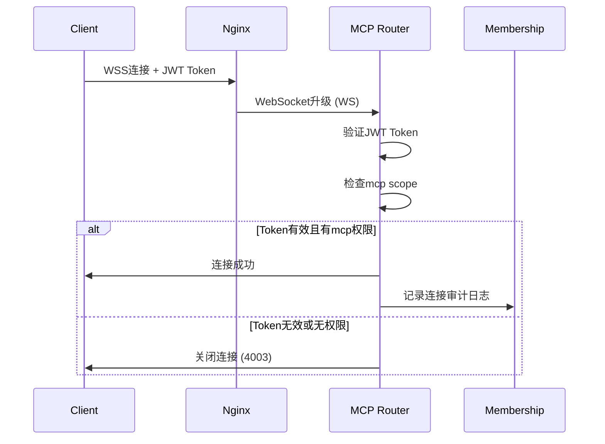

# MCP 路由服务设计方案

**版本**: 1.0
**日期**: 2026-02-08
**状态**: 设计阶段

---

## 目录

1. [概述](#概述)
2. [系统架构](#系统架构)
3. [核心功能模块](#核心功能模块)
4. [JWT认证集成](#jwt认证集成)
5. [WebSocket协议处理](#websocket协议处理)
6. [审计集成模块](#审计集成模块)
7. [实现代码](#实现代码)
8. [部署方案](#部署方案)
9. [使用指南](#使用指南)
10. [测试方案](#测试方案)

---

## 概述

### 目标

实现一个完整的MCP（Model Context Protocol）路由服务，使外部MCP客户端能够通过标准WebSocket协议访问系统内部的MCP服务器工具。

### 核心功能

1. **协议支持** - 实现MCP协议的WebSocket传输层
2. **客户端认证** - JWT token验证，支持mcp权限scope
3. **工具路由** - 将客户端请求路由到后端MCP服务器
4. **消息转换** - JSON-RPC协议与内部调用的转换
5. **连接管理** - WebSocket连接生命周期管理
6. **审计日志** - 调用membership审计服务记录操作

### 设计原则

- ✅ **标准兼容** - 严格遵循MCP协议规范
- ✅ **高性能** - 异步处理，支持大量并发连接
- ✅ **可扩展** - 模块化设计，易于添加新功能
- ✅ **安全可靠** - JWT认证 + 审计日志

---

## 系统架构

### 整体架构图

```
┌─────────────────────────────────────────────────────────────┐
│                     外部MCP客户端                            │
│  (Claude Desktop, Cursor, 其他MCP客户端)                     │
└────────────────────────┬────────────────────────────────────┘
                         │
                         │ WebSocket + JWT
                         ▼
┌─────────────────────────────────────────────────────────────┐
│                    Nginx 反向代理                            │
│  - SSL终止 (WSS)                                             │
│  - 负载均衡                                                  │
│  - 请求路由                                                  │
└────────────────────────┬────────────────────────────────────┘
                         │
                         │ HTTP/WebSocket
                         ▼
┌─────────────────────────────────────────────────────────────┐
│                  MCP Router 服务                             │
├─────────────────────────────────────────────────────────────┤
│                                                               │
│  ┌─────────────────────────────────────────────────────┐    │
│  │              WebSocket 连接层                        │    │
│  │  - 连接接受/关闭                                     │    │
│  │  - 消息接收/发送                                     │    │
│  │  - 心跳保活                                         │    │
│  └────────────────┬────────────────────────────────────┘    │
│                   │                                          │
│  ┌────────────────▼────────────────────────────────────┐    │
│  │              JWT 认证中间件                          │    │
│  │  - Token验证                                        │    │
│  │  - MCP权限检查                                      │    │
│  │  - 客户端信息提取                                   │    │
│  └────────────────┬────────────────────────────────────┘    │
│                   │                                          │
│  ┌────────────────▼────────────────────────────────────┐    │
│  │            MCP 协议处理器                            │    │
│  │  - JSON-RPC消息解析                                 │    │
│  │  - 方法路由 (tools/list, tools/call)                │    │
│  │  - 参数验证                                         │    │
│  └────────────────┬────────────────────────────────────┘    │
│                   │                                          │
│  ┌────────────────▼────────────────────────────────────┐    │
│  │            工具执行路由器                            │    │
│  │  - 解析工具名称 (mcp_server.tool_name)              │    │
│  │  - 调用MCP Registry                                 │    │
│  │  - 执行后端MCP工具                                  │    │
│  └────────────────┬────────────────────────────────────┘    │
│                   │                                          │
│  ┌────────────────▼────────────────────────────────────┐    │
│  │            响应转换器                                │    │
│  │  - 结果格式转换                                     │    │
│  │  - 错误处理                                         │    │
│  │  - 构造JSON-RPC响应                                │    │
│  └────────────────┬────────────────────────────────────┘    │
│                   │                                          │
│  ┌────────────────▼────────────────────────────────────┐    │
│  │            审计日志记录                              │    │
│  │  - 记录工具调用                                     │    │
│  │  - 记录连接事件                                     │    │
│  │  - 调用membership审计API                           │    │
│  └────────────────┬────────────────────────────────────┘    │
│                   │                                          │
│  ┌────────────────▼────────────────────────────────────┐    │
│  │          连接管理器                                  │    │
│  │  - 活跃连接跟踪                                     │    │
│  │  - 广播消息                                         │    │
│  │  - 断线处理                                         │    │
│  └─────────────────────────────────────────────────────┘    │
│                                                               │
└────────────────────────┬────────────────────────────────────┘
                         │
                         │ 工具执行调用
                         ▼
┌─────────────────────────────────────────────────────────────┐
│                   MCP Registry                               │
│  - 管理所有MCP服务器                                         │
│  - 工具注册表                                                │
│  - 工具执行调度                                              │
└────────────────────────┬────────────────────────────────────┘
                         │
         ┌───────────────┼───────────────┐
         │               │               │
         ▼               ▼               ▼
┌─────────────┐ ┌─────────────┐ ┌─────────────┐
│ Membership  │ │  Database   │ │  Custom     │
│    MCP      │ │    MCP      │ │    MCP      │
└─────────────┘ └─────────────┘ └─────────────┘
```

### 数据流向

```
1. 客户端连接流程
   Client ──(WSS+JWT)──▶ Nginx ──(WS)──▶ MCP Router
                                              │
                                         JWT验证
                                              │
                                         提取客户端信息
                                              │
                                         接受连接

2. 工具调用流程
   Client ──(JSON-RPC)──▶ MCP Router ──(解析)──▶ 工具路由器
                                                 │
                                            调用MCP Registry
                                                 │
                                            执行后端工具
                                                 │
                                            返回结果
                                                 │
                                            转换为JSON-RPC
                                                 │
                                            记录审计日志
                                                 │
   Client ◀─(JSON-RPC)───  MCP Router ◀────────────┘
```

---

## 核心功能模块

### 1. WebSocket连接管理器

**职责**：
- 接受/关闭WebSocket连接
- 管理活跃连接列表
- 处理连接异常
- 支持客户端信息关联

```python
# src/mcp/connection_manager.py

from typing import Dict, Set
from fastapi import WebSocket
import logging

logger = logging.getLogger(__name__)

class ConnectionManager:
    """WebSocket连接管理器"""

    def __init__(self):
        # client_id -> WebSocket
        self.active_connections: Dict[str, WebSocket] = {}
        # client_id -> client_info
        self.client_info: Dict[str, dict] = {}

    async def connect(
        self,
        websocket: WebSocket,
        client_id: str,
        client_info: dict
    ):
        """接受新连接"""
        await websocket.accept()
        self.active_connections[client_id] = websocket
        self.client_info[client_id] = client_info
        logger.info(f"Client connected: {client_id} ({client_info.get('name', 'Unknown')})")

    def disconnect(self, client_id: str):
        """断开连接"""
        if client_id in self.active_connections:
            del self.active_connections[client_id]
        if client_id in self.client_info:
            del self.client_info[client_id]
        logger.info(f"Client disconnected: {client_id}")

    async def send_message(
        self,
        client_id: str,
        message: dict
    ) -> bool:
        """发送消息给指定客户端"""
        websocket = self.active_connections.get(client_id)
        if not websocket:
            logger.warning(f"Client not found: {client_id}")
            return False

        try:
            await websocket.send_json(message)
            return True
        except Exception as e:
            logger.error(f"Failed to send message to {client_id}: {e}")
            self.disconnect(client_id)
            return False

    async def broadcast(self, message: dict):
        """广播消息给所有连接的客户端"""
        disconnected = []
        for client_id, websocket in self.active_connections.items():
            try:
                await websocket.send_json(message)
            except Exception as e:
                logger.error(f"Failed to broadcast to {client_id}: {e}")
                disconnected.append(client_id)

        # 清理断开的连接
        for client_id in disconnected:
            self.disconnect(client_id)

    def get_connection_count(self) -> int:
        """获取当前连接数"""
        return len(self.active_connections)

    def get_client_info(self, client_id: str) -> dict:
        """获取客户端信息"""
        return self.client_info.get(client_id, {})

    def is_connected(self, client_id: str) -> bool:
        """检查客户端是否连接"""
        return client_id in self.active_connections
```

### 2. JWT认证器

**职责**：
- 验证JWT token
- 检查MCP权限scope
- 提取客户端信息

```python
# src/mcp/auth_jwt.py

from typing import Optional
from datetime import datetime
import jwt
from jwt import PyJWTError
from fastapi import HTTPException, WebSocket, status
import logging

logger = logging.getLogger(__name__)

class JWTAuthConfig:
    """JWT认证配置"""
    def __init__(
        self,
        secret_key: str,
        algorithm: str = "HS256",
        required_scope: str = "mcp",
        issuer: Optional[str] = None,
        audience: Optional[str] = None
    ):
        self.secret_key = secret_key
        self.algorithm = algorithm
        self.required_scope = required_scope
        self.issuer = issuer
        self.audience = audience

class MCPJWTAuth:
    """MCP JWT认证器"""

    def __init__(self, config: JWTAuthConfig):
        self.config = config

    def validate_token(self, token: str) -> dict:
        """
        验证JWT token并返回payload

        Args:
            token: JWT字符串

        Returns:
            dict: JWT payload

        Raises:
            HTTPException: Token无效或缺少MCP权限
        """
        try:
            # 解码JWT
            payload = jwt.decode(
                token,
                self.config.secret_key,
                algorithms=[self.config.algorithm],
                issuer=self.config.issuer,
                audience=self.config.audience
            )

            # 检查MCP权限
            if not self._has_mcp_permission(payload):
                logger.warning(f"Token valid but missing MCP permission: {payload.get('sub')}")
                raise HTTPException(
                    status_code=status.HTTP_403_FORBIDDEN,
                    detail="Missing MCP permission scope"
                )

            logger.info(f"JWT validated successfully for: {payload.get('sub')}")
            return payload

        except PyJWTError as e:
            logger.error(f"JWT validation failed: {str(e)}")
            raise HTTPException(
                status_code=status.HTTP_401_UNAUTHORIZED,
                detail=f"Invalid token: {str(e)}"
            )

    def _has_mcp_permission(self, payload: dict) -> bool:
        """
        检查payload中是否包含MCP权限

        支持多种格式:
        - scopes: ["mcp:*", "mcp.read", ...]
        - permissions: ["mcp.access", "mcp.tools.execute", ...]
        - resource_access: {"mcp": {"roles": ["admin"]}}
        """
        # 方式1: 检查scopes字段
        scopes = payload.get("scopes", payload.get("scope", []))
        if isinstance(scopes, str):
            scopes = scopes.split()

        for scope in scopes:
            if scope.startswith("mcp") or scope == "mcp:*":
                return True

        # 方式2: 检查permissions字段
        permissions = payload.get("permissions", [])
        for perm in permissions:
            if perm.startswith("mcp"):
                return True

        # 方式3: 检查resource_access (Keycloak风格)
        resource_access = payload.get("resource_access", {})
        if "mcp" in resource_access:
            return True

        return False

    def extract_client_info(self, payload: dict) -> dict:
        """从payload提取客户端信息"""
        return {
            "client_id": payload.get("sub", payload.get("user_id", "unknown")),
            "name": payload.get("name", payload.get("preferred_username", "Unknown")),
            "tenant_id": payload.get("tenant_id"),
            "scopes": payload.get("scopes", []),
            "permissions": payload.get("permissions", []),
            "exp": payload.get("exp"),
            "iat": payload.get("iat")
        }

    async def authenticate_websocket(
        self,
        websocket: WebSocket,
        token_param: str = "token"
    ) -> Optional[dict]:
        """
        WebSocket连接认证

        Args:
            websocket: FastAPI WebSocket连接
            token_param: URL参数名（默认token）

        Returns:
            dict: 客户端信息，认证失败返回None
        """
        # 从查询参数获取token
        token = websocket.query_params.get(token_param)

        if not token:
            # 也可以从Authorization header获取
            auth_header = websocket.headers.get("authorization", "")
            if auth_header.startswith("Bearer "):
                token = auth_header[7:]

        if not token:
            await websocket.close(code=4001, reason="Missing token")
            return None

        try:
            payload = self.validate_token(token)
            client_info = self.extract_client_info(payload)

            logger.info(f"WebSocket authenticated: {client_info['client_id']}")
            return client_info

        except HTTPException as e:
            await websocket.close(code=4003, reason=e.detail)
            return None
```

### 3. MCP协议处理器

**职责**：
- 解析JSON-RPC消息
- 方法路由
- 参数验证
- 构造响应

```python
# src/mcp/protocol_handler.py

from typing import Optional, Dict, Any
import json
import logging

logger = logging.getLogger(__name__)

class MCPMessage:
    """MCP消息模型"""

    def __init__(
        self,
        jsonrpc: str = "2.0",
        id: Optional[Any] = None,
        method: Optional[str] = None,
        params: Optional[dict] = None,
        result: Optional[Any] = None,
        error: Optional[dict] = None
    ):
        self.jsonrpc = jsonrpc
        self.id = id
        self.method = method
        self.params = params or {}
        self.result = result
        self.error = error

    def to_dict(self) -> dict:
        """转换为字典"""
        data = {"jsonrpc": self.jsonrpc}

        if self.id is not None:
            data["id"] = self.id

        if self.method:
            data["method"] = self.method
            if self.params:
                data["params"] = self.params

        if self.result is not None:
            data["result"] = self.result

        if self.error:
            data["error"] = self.error

        return data

    @staticmethod
    def from_dict(data: dict) -> 'MCPMessage':
        """从字典创建"""
        return MCPMessage(
            jsonrpc=data.get("jsonrpc", "2.0"),
            id=data.get("id"),
            method=data.get("method"),
            params=data.get("params"),
            result=data.get("result"),
            error=data.get("error")
        )

class MCPProtocolHandler:
    """MCP协议处理器"""

    def __init__(self):
        self.supported_methods = {
            "initialize": self._handle_initialize,
            "tools/list": self._handle_tools_list,
            "tools/call": self._handle_tools_call,
            "resources/list": self._handle_resources_list,
            "resources/read": self._handle_resources_read,
            "prompts/list": self._handle_prompts_list,
            "prompts/get": self._handle_prompts_get,
        }

    async def handle_message(
        self,
        message: dict,
        context: dict
    ) -> Optional[dict]:
        """
        处理MCP消息

        Args:
            message: JSON-RPC消息
            context: 上下文信息（client_info, registry等）

        Returns:
            dict: JSON-RPC响应
        """
        try:
            mcp_msg = MCPMessage.from_dict(message)
        except Exception as e:
            logger.error(f"Failed to parse message: {e}")
            return {
                "jsonrpc": "2.0",
                "id": message.get("id"),
                "error": {
                    "code": -32700,
                    "message": "Parse error"
                }
            }

        # 检查方法
        if not mcp_msg.method:
            return {
                "jsonrpc": "2.0",
                "id": mcp_msg.id,
                "error": {
                    "code": -32600,
                    "message": "Invalid Request"
                }
            }

        # 路由到对应的处理器
        handler = self.supported_methods.get(mcp_msg.method)
        if not handler:
            return {
                "jsonrpc": "2.0",
                "id": mcp_msg.id,
                "error": {
                    "code": -32601,
                    "message": f"Method not found: {mcp_msg.method}"
                }
            }

        # 执行处理器
        try:
            result = await handler(mcp_msg, context)
            return {
                "jsonrpc": "2.0",
                "id": mcp_msg.id,
                "result": result
            }
        except Exception as e:
            logger.error(f"Error handling {mcp_msg.method}: {e}")
            return {
                "jsonrpc": "2.0",
                "id": mcp_msg.id,
                "error": {
                    "code": -32603,
                    "message": "Internal error",
                    "data": str(e)
                }
            }

    async def _handle_initialize(
        self,
        message: MCPMessage,
        context: dict
    ) -> dict:
        """处理initialize请求"""
        params = message.params or {}
        client_info = context.get("client_info", {})

        logger.info(f"Initialize handshake from {client_info.get('client_id')}")

        return {
            "protocolVersion": "2024-11-05",
            "serverInfo": {
                "name": "AICMDEngine MCP Router",
                "version": "1.0.0"
            },
            "capabilities": {
                "tools": {},
                "resources": {},
                "prompts": {}
            }
        }

    async def _handle_tools_list(
        self,
        message: MCPMessage,
        context: dict
    ) -> dict:
        """处理tools/list请求"""
        registry = context.get("registry")
        if not registry:
            raise ValueError("Registry not available")

        tools = []
        for mcp in registry.get_all_mcps():
            mcp_info = mcp.get_info()
            tools_list = mcp_info.get("tools", [])

            # tools可能是list或dict
            if isinstance(tools_list, dict):
                tools_list_items = tools_list.items()
            else:
                tools_list_items = [(t.get("name"), t) for t in tools_list]

            for tool_name, tool_info in tools_list_items:
                tools.append({
                    "name": f"{mcp.name}.{tool_name}",
                    "description": tool_info.get("description", ""),
                    "inputSchema": tool_info.get("inputSchema", {})
                })

        return {"tools": tools}

    async def _handle_tools_call(
        self,
        message: MCPMessage,
        context: dict
    ) -> dict:
        """处理tools/call请求"""
        registry = context.get("registry")
        if not registry:
            raise ValueError("Registry not available")

        params = message.params or {}
        tool_name = params.get("name")
        arguments = params.get("arguments", {})

        if not tool_name:
            raise ValueError("Missing tool name")

        # 解析工具名称
        parts = tool_name.split(".", 1)
        if len(parts) != 2:
            raise ValueError(f"Invalid tool name format: {tool_name}")

        mcp_name, tool_name = parts

        # 执行工具
        try:
            result = await registry.execute_command(
                mcp_name=mcp_name,
                tool_name=tool_name,
                **arguments
            )

            return {
                "content": [{
                    "type": "text",
                    "text": result.content
                }],
                "isError": not result.success
            }

        except Exception as e:
            logger.error(f"Tool execution error: {e}")
            raise

    async def _handle_resources_list(
        self,
        message: MCPMessage,
        context: dict
    ) -> dict:
        """处理resources/list请求"""
        # 暂不实现resources
        return {"resources": []}

    async def _handle_resources_read(
        self,
        message: MCPMessage,
        context: dict
    ) -> dict:
        """处理resources/read请求"""
        # 暂不实现resources
        raise ValueError("Resources not implemented")

    async def _handle_prompts_list(
        self,
        message: MCPMessage,
        context: dict
    ) -> dict:
        """处理prompts/list请求"""
        # 暂不实现prompts
        return {"prompts": []}

    async def _handle_prompts_get(
        self,
        message: MCPMessage,
        context: dict
    ) -> dict:
        """处理prompts/get请求"""
        # 暂不实现prompts
        raise ValueError("Prompts not implemented")
```

### 4. 审计集成模块

**职责**：
- 记录客户端连接事件
- 记录工具调用
- 调用membership审计API

```python
# src/mcp/audit_integration.py

from typing import Optional, Dict, Any
from datetime import datetime
import logging

logger = logging.getLogger(__name__)

class MCPAuditLogger:
    """MCP审计日志记录器"""

    def __init__(self, mcp_registry):
        """
        初始化审计日志记录器

        Args:
            mcp_registry: MCP注册表，用于调用membership服务
        """
        self.mcp_registry = mcp_registry
        self.membership_name = "membership"

    async def log_connection_event(
        self,
        client_id: str,
        client_name: str,
        event: str,  # connect, disconnect, error
        details: Optional[Dict[str, Any]] = None,
        request_ip: Optional[str] = None
    ):
        """记录连接事件"""
        log_entry = {
            "timestamp": datetime.utcnow().isoformat() + "Z",
            "client_id": client_id,
            "client_name": client_name,
            "client_type": "mcp_client",
            "service": "mcp_router",
            "resource_type": "connection",
            "resource_id": client_id,
            "action": event,
            "request_details": details or {},
            "request_ip": request_ip,
            "success": True,
            "sensitivity_level": "normal"
        }

        try:
            await self.mcp_registry.execute_command(
                mcp_name=self.membership_name,
                tool_name="create_audit_log",
                **log_entry
            )
            logger.info(f"Audit log recorded: {event} - {client_id}")
        except Exception as e:
            logger.error(f"Failed to record audit log: {e}")

    async def log_tool_call(
        self,
        client_id: str,
        client_name: str,
        mcp_server: str,
        tool_name: str,
        arguments: Dict[str, Any],
        success: bool,
        error_message: Optional[str] = None,
        duration_ms: float = 0
    ):
        """记录工具调用"""
        # 脱敏参数
        sanitized_args = self._sanitize_arguments(arguments)

        log_entry = {
            "timestamp": datetime.utcnow().isoformat() + "Z",
            "client_id": client_id,
            "client_name": client_name,
            "client_type": "mcp_client",
            "service": "mcp_router",
            "resource_type": "mcp_tool",
            "resource_id": f"{mcp_server}.{tool_name}",
            "action": "tools/call",
            "action_method": "WebSocket",
            "request_details": {
                "parameters": sanitized_args,
                "mcp_server": mcp_server,
                "tool_name": tool_name
            },
            "response_time_ms": int(duration_ms),
            "success": success,
            "error_message": error_message,
            "sensitivity_level": self._determine_sensitivity(arguments),
            "metadata": {
                "mcp_server": mcp_server,
                "tool_name": tool_name
            }
        }

        try:
            await self.mcp_registry.execute_command(
                mcp_name=self.membership_name,
                tool_name="create_audit_log",
                **log_entry
            )
            logger.debug(f"Audit log recorded: tools/call - {mcp_server}.{tool_name}")
        except Exception as e:
            logger.error(f"Failed to record audit log: {e}")

    def _sanitize_arguments(self, arguments: Dict[str, Any]) -> Dict[str, Any]:
        """脱敏敏感参数"""
        import copy
        sanitized = copy.deepcopy(arguments)

        sensitive_keywords = [
            "password", "token", "secret", "key",
            "credential", "authorization"
        ]

        def sanitize_value(key: str, value: Any) -> Any:
            if isinstance(value, dict):
                return {k: sanitize_value(k, v) for k, v in value.items()}
            elif isinstance(value, list):
                return [sanitize_value(key, item) for item in value]
            elif isinstance(value, str):
                if any(kw in key.lower() for kw in sensitive_keywords):
                    return "***REDACTED***"
            return value

        return {k: sanitize_value(k, v) for k, v in sanitized.items()}

    def _determine_sensitivity(self, arguments: Dict[str, Any]) -> str:
        """确定敏感级别"""
        sensitive_keywords = ["password", "token", "secret", "key"]

        for key in str(arguments).lower():
            if any(kw in key for kw in sensitive_keywords):
                return "sensitive"

        return "normal"
```

---

## JWT认证集成

### 配置

```python
# src/core/config.py

from pydantic_settings import BaseSettings

class Settings(BaseSettings):
    # JWT配置
    jwt_secret_key: str
    jwt_algorithm: str = "HS256"
    jwt_expected_issuer: Optional[str] = None
    jwt_expected_audience: Optional[str] = None

    # WebSocket配置
    ws_ping_interval: int = 20
    ws_ping_timeout: int = 20
    ws_max_connections: int = 1000

    # MCP配置
    mcp_required_scope: str = "mcp"

    class Config:
        env_file = ".env"

settings = Settings()
```

### 认证流程



---

## WebSocket协议处理

### WebSocket端点实现

```python
# src/routers/mcp_ws.py

from fastapi import APIRouter, WebSocket, WebSocketDisconnect, Depends
from typing import Optional
import logging
import json

from ..mcp.connection_manager import ConnectionManager
from ..mcp.auth_jwt import MCPJWTAuth, JWTAuthConfig
from ..mcp.protocol_handler import MCPProtocolHandler
from ..mcp.audit_integration import MCPAuditLogger
from ..core.config import settings

logger = logging.getLogger(__name__)

router = APIRouter()

# 全局单例
connection_manager = ConnectionManager()
protocol_handler = MCPProtocolHandler()

@router.websocket("/mcp/v1")
async def mcp_websocket_endpoint(
    websocket: WebSocket,
    token: Optional[str] = None,
    registry = Depends(get_mcp_registry)
):
    """
    MCP WebSocket端点

    连接URL: ws://localhost:8000/mcp/v1?token=xxx
    或通过header: Authorization: Bearer xxx
    """

    # 初始化认证器
    auth_config = JWTAuthConfig(
        secret_key=settings.jwt_secret_key,
        algorithm=settings.jwt_algorithm,
        required_scope=settings.mcp_required_scope
    )
    auth = MCPJWTAuth(auth_config)

    # 认证客户端
    client_info = await auth.authenticate_websocket(websocket)
    if not client_info:
        return

    client_id = client_info["client_id"]

    # 初始化审计日志
    audit_logger = MCPAuditLogger(registry)

    # 记录连接事件
    await audit_logger.log_connection_event(
        client_id=client_id,
        client_name=client_info.get("name"),
        event="connect",
        request_ip=websocket.client.host if websocket.client else None
    )

    # 接受连接
    await connection_manager.connect(websocket, client_id, client_info)

    # 准备上下文
    context = {
        "client_id": client_id,
        "client_info": client_info,
        "registry": registry,
        "audit_logger": audit_logger
    }

    try:
        # 消息循环
        while True:
            # 接收消息
            data = await websocket.receive_text()

            try:
                message = json.loads(data)
                logger.debug(f"Received message from {client_id}: {message}")

                # 处理消息
                response = await protocol_handler.handle_message(message, context)

                if response:
                    await websocket.send_json(response)

                    # 记录工具调用审计（如果是tools/call）
                    if message.get("method") == "tools/call" and response.get("result"):
                        await _log_tool_execution(
                            message, response, client_info, audit_logger
                        )

            except json.JSONDecodeError as e:
                logger.error(f"Invalid JSON from {client_id}: {e}")
                await websocket.send_json({
                    "jsonrpc": "2.0",
                    "id": None,
                    "error": {
                        "code": -32700,
                        "message": "Parse error"
                    }
                })

            except Exception as e:
                logger.error(f"Error handling message from {client_id}: {e}")
                await websocket.send_json({
                    "jsonrpc": "2.0",
                    "id": message.get("id"),
                    "error": {
                        "code": -32603,
                        "message": "Internal error"
                    }
                })

    except WebSocketDisconnect:
        logger.info(f"WebSocket disconnected: {client_id}")

    except Exception as e:
        logger.error(f"WebSocket error: {e}")

    finally:
        # 清理
        connection_manager.disconnect(client_id)

        # 记录断开事件
        await audit_logger.log_connection_event(
            client_id=client_id,
            client_name=client_info.get("name"),
            event="disconnect"
        )


async def _log_tool_execution(
    request_message: dict,
    response_message: dict,
    client_info: dict,
    audit_logger: MCPAuditLogger
):
    """记录工具执行审计"""
    try:
        params = request_message.get("params", {})
        tool_name = params.get("name", "")
        arguments = params.get("arguments", {})

        result = response_message.get("result", {})
        is_error = result.get("isError", False)
        content = result.get("content", [{}])[0]
        error_msg = content.get("text") if is_error else None

        # 解析工具名称
        parts = tool_name.split(".", 1)
        mcp_server = parts[0] if len(parts) == 2 else "unknown"

        await audit_logger.log_tool_call(
            client_id=client_info.get("client_id"),
            client_name=client_info.get("name"),
            mcp_server=mcp_server,
            tool_name=parts[1] if len(parts) == 2 else tool_name,
            arguments=arguments,
            success=not is_error,
            error_message=error_msg,
            duration_ms=0  # 可选：添加计时
        )
    except Exception as e:
        logger.error(f"Failed to log tool execution: {e}")
```

---

## 审计集成模块

### Membership审计API调用

MCP Router调用membership服务的审计工具来记录日志：

```python
# 示例：调用membership的create_audit_log工具

await mcp_registry.execute_command(
    mcp_name="membership",
    tool_name="create_audit_log",
    client_id="claude-desktop-123",
    client_name="Claude Desktop",
    service="mcp_router",
    resource_type="mcp_tool",
    resource_id="membership.list_members",
    action="tools/call",
    request_details={
        "parameters": {"page": 1, "limit": 10}
    },
    response_time_ms=245,
    success=True
)
```

### 审计事件类型

| 事件类型 | 触发时机 | 记录内容 |
|---------|---------|----------|
| connect | 客户端连接成功 | client_id, name, ip |
| disconnect | 客户端断开连接 | client_id, name |
| error | 连接/消息处理错误 | client_id, error |
| tools/call | 执行工具 | tool_name, args, result, duration |

---

## 实现代码

### 项目结构

```
src/
├── mcp/
│   ├── __init__.py
│   ├── connection_manager.py    # 连接管理器
│   ├── auth_jwt.py               # JWT认证器
│   ├── protocol_handler.py       # MCP协议处理器
│   └── audit_integration.py      # 审计集成
├── routers/
│   └── mcp_ws.py                 # WebSocket路由
├── core/
│   └── config.py                 # 配置
└── main.py                       # 应用入口
```

### 完整代码

**主要文件已在上面各模块中给出，这里补充配置文件：**

```python
# src/main.py

from fastapi import FastAPI
from fastapi.middleware.cors import CORSMiddleware
from src.routers import mcp_ws
from src.core.config import settings

app = FastAPI(title="AICMDEngine MCP Router")

# CORS
app.add_middleware(
    CORSMiddleware,
    allow_origins=["*"],  # 生产环境应限制
    allow_credentials=True,
    allow_methods=["*"],
    allow_headers=["*"],
)

# 路由
app.include_router(mcp_ws.router, tags=["MCP WebSocket"])

@app.get("/health")
async def health_check():
    return {"status": "ok", "service": "mcp-router"}

@app.get("/")
async def root():
    return {
        "service": "MCP Router",
        "version": "1.0.0",
        "endpoints": {
            "websocket": "/mcp/v1",
            "health": "/health"
        }
    }

if __name__ == "__main__":
    import uvicorn
    uvicorn.run(
        "main:app",
        host="0.0.0.0",
        port=8000,
        reload=settings.environment == "development"
    )
```

```python
# src/core/dependencies.py

from fastapi import Depends
from src.mcp.registry import MCPRegistry

# 全局MCP注册表
_mcp_registry = None

def get_mcp_registry() -> MCPRegistry:
    """获取MCP注册表"""
    global _mcp_registry
    return _mcp_registry

def set_mcp_registry(registry: MCPRegistry):
    """设置MCP注册表"""
    global _mcp_registry
    _mcp_registry = registry
```

---

## 部署方案

### Docker配置

```dockerfile
# Dockerfile

FROM python:3.11-slim

WORKDIR /app

COPY requirements.txt .
RUN pip install --no-cache-dir -r requirements.txt

COPY src/ src/

EXPOSE 8000

CMD ["python", "-m", "src.main"]
```

```yaml
# docker-compose.yml

version: '3.8'

services:
  mcp-router:
    build: .
    ports:
      - "8000:8000"
    environment:
      - JWT_SECRET_KEY=${JWT_SECRET_KEY}
      - JWT_ALGORITHM=HS256
      - MCP_REQUIRED_SCOPE=mcp
    networks:
      - internal
    deploy:
      replicas: 2
      resources:
        limits:
          cpus: '1'
          memory: 512M

  nginx:
    image: nginx:alpine
    ports:
      - "443:443"
      - "80:80"
    volumes:
      - ./nginx.conf:/etc/nginx/conf.d/mcp-router.conf:ro
      - ./ssl:/etc/nginx/ssl:ro
    depends_on:
      - mcp-router
    networks:
      - internal

networks:
  internal:
```

### Nginx配置

```nginx
# /etc/nginx/conf.d/mcp-router.conf

upstream mcp_router_backend {
    server mcp-router:8000;
}

# WSS endpoint
server {
    listen 443 ssl http2;
    server_name mcp.yourcompany.com;

    ssl_certificate /etc/nginx/ssl/cert.pem;
    ssl_certificate_key /etc/nginx/ssl/key.pem;

    location /mcp/v1 {
        proxy_pass http://mcp_router_backend;
        proxy_http_version 1.1;

        proxy_set_header Upgrade $http_upgrade;
        proxy_set_header Connection "upgrade";
        proxy_set_header Host $host;
        proxy_set_header X-Real-IP $remote_addr;
        proxy_set_header X-Forwarded-For $proxy_add_x_forwarded_for;
        proxy_set_header X-Forwarded-Proto $scheme;

        proxy_connect_timeout 7d;
        proxy_send_timeout 7d;
        proxy_read_timeout 7d;
    }

    location /health {
        proxy_pass http://mcp_router_backend/health;
    }
}
```

---

## 使用指南

### 客户端连接示例

```typescript
// Claude Desktop MCP客户端配置

const MCPClient = {
  async connect(jwt: string) {
    const ws = new WebSocket(`wss://mcp.yourcompany.com/mcp/v1?token=${jwt}`);

    ws.onopen = async () => {
      console.log('Connected to MCP Router');

      // 初始化握手
      ws.send(JSON.stringify({
        jsonrpc: "2.0",
        id: 1,
        method: "initialize",
        params: {
          protocolVersion: "2024-11-05",
          capabilities: {},
          clientInfo: {
            name: "claude-desktop",
            version: "1.0.0"
          }
        }
      }));

      // 请求工具列表
      ws.send(JSON.stringify({
        jsonrpc: "2.0",
        id: 2,
        method: "tools/list"
      }));
    };

    ws.onmessage = (event) => {
      const response = JSON.parse(event.data);
      console.log('Received:', response);

      if (response.result && response.result.tools) {
        console.log('Available tools:', response.result.tools);
      }
    };

    return ws;
  }
};

// 使用
const jwt = localStorage.getItem('jwt_token');
MCPClient.connect(jwt);
```

### 测试工具

```bash
# 使用websocat测试

# 1. 连接（带token）
websocat "wss://mcp.yourcompany.com/mcp/v1?token=YOUR_JWT_TOKEN"

# 2. 发送initialize请求
{"jsonrpc":"2.0","id":1,"method":"initialize","params":{"protocolVersion":"2024-11-05"}}

# 3. 请求工具列表
{"jsonrpc":"2.0","id":2,"method":"tools/list"}

# 4. 调用工具
{"jsonrpc":"2.0","id":3,"method":"tools/call","params":{"name":"membership.list_members","arguments":{"page":1,"limit":10}}}
```

---

## 测试方案

### 单元测试

```python
# tests/test_mcp_auth.py

import pytest
from src.mcp.auth_jwt import MCPJWTAuth, JWTAuthConfig

def test_validate_valid_token():
    """测试有效token验证"""
    config = JWTAuthConfig(secret_key="test-secret")
    auth = MCPJWTAuth(config)

    import jwt
    token = jwt.encode(
        {
            "sub": "user123",
            "scopes": ["mcp:*"],
            "exp": int(time.time()) + 3600
        },
        "test-secret"
    )

    payload = auth.validate_token(token)
    assert payload["sub"] == "user123"

def test_validate_token_without_mcp_scope():
    """测试缺少mcp权限的token"""
    config = JWTAuthConfig(secret_key="test-secret")
    auth = MCPJWTAuth(config)

    import jwt
    token = jwt.encode(
        {
            "sub": "user123",
            "scopes": ["api:read"],  # 没有mcp权限
            "exp": int(time.time()) + 3600
        },
        "test-secret"
    )

    with pytest.raises(HTTPException) as exc:
        auth.validate_token(token)
    assert exc.value.status_code == 403
```

### 集成测试

```python
# tests/test_mcp_ws_integration.py

import pytest
from fastapi.testclient import TestClient
from src.main import app

@pytest.mark.asyncio
async def test_websocket_connection():
    """测试WebSocket连接"""
    client = TestClient(app)

    # 生成测试JWT
    import jwt
    token = jwt.encode(
        {
            "sub": "test-client",
            "scopes": ["mcp:*"],
            "exp": int(time.time()) + 3600
        },
        "test-secret"
    )

    # 连接WebSocket
    with client.websocket_connect(f"/mcp/v1?token={token}") as websocket:
        # 发送initialize
        websocket.send_json({
            "jsonrpc": "2.0",
            "id": 1,
            "method": "initialize",
            "params": {}
        })

        # 接收响应
        response = websocket.receive_json()
        assert response["result"]["serverInfo"]["name"] == "AICMDEngine MCP Router"
```

---

## 总结

本方案设计了一个完整的MCP路由服务，包括：

✅ **WebSocket连接管理** - 高性能异步处理
✅ **JWT认证** - 标准token验证，支持mcp权限
✅ **MCP协议支持** - 完整实现tools/list和tools/call
✅ **工具路由** - 透明路由到后端MCP服务器
✅ **审计集成** - 调用membership审计服务记录操作

**下一步**：实现代码、测试、部署。
